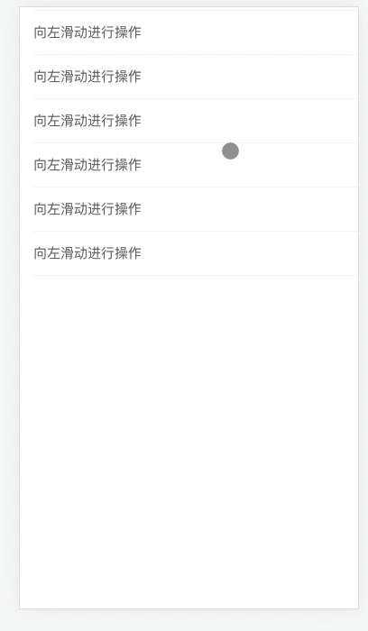
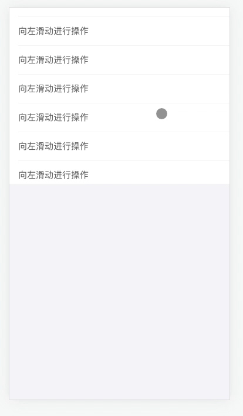
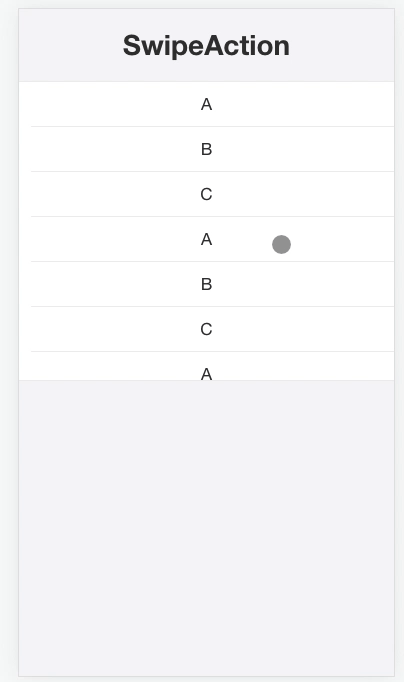

# 滑动互相影响问题

业务开发中通常会遇到一种场景是左滑删除的场景，这种场景在 ios 中是非常常见的一种操作形式。很多时候 h5 也会遇到这种场景，h5 移植左滑删除还是蛮简单的，但是可能会遇到一种场景或许这种场景也是移动端开发都会遇到的一种场景即使：

在固定的区域中存在左滑的 `SwipeAction` 组件，以及可以上下滚动。最理想的效果是：

- 上下滚动不会造成 `SwipeAction` 的左右滑动。
- `SwipeAction` 的左右滑动不会影响上下滚动。

这通常也引申到即：左右滑动不会影响上下滑动，上下滑动不会影响左右滑动。比如拼多多 APP 中，上下滑动列表不会导致左右滑动到另外一个 Tab。

那么该如何解决这一类的问题呢？

css3 有新的属性叫 [touch-action](https://developer.mozilla.org/zh-CN/docs/Web/CSS/touch-action), touch-action 可以控制元素内的行为。

touch-action 常用的值如下：

- `auto` 当触控事件发生在元素上时，由浏览器来决定进行哪些操作，比如对 viewport 进行平滑、缩放等。
- `none` 当触控事件发生在元素上时，不进行任何操作。
- `pan-x` 启用单指水平平移手势。可以与 **pan-y** 、**pan-up**、**pan-down** 和／或 **pinch-zoom** 组合使用。
- `pan-y` 启用单指垂直平移手势。可以与 **pan-y** 、**pan-up**、**pan-down** 和／或 **pinch-zoom** 组合使用。
- `manipulation` 浏览器只允许进行滚动和持续缩放操作。任何其它被 auto 值支持的行为不被支持。启用平移和缩小缩放手势，但禁用其他非标准手势，例如双击以进行缩放。 禁用双击可缩放功能可减少浏览器在用户点击屏幕时延迟生成点击事件的需要。 这是“pan-x pan-y pinch-zoom”（为了兼容性本身仍然有效）的别名。
- `pan-left, pan-right,pan-up,pan-down(实验性)` 启用以指定方向滚动开始的单指手势。 一旦滚动开始，方向可能仍然相反。 请注意，滚动“向上”（pan-up）意味着用户正在将其手指向下拖动到屏幕表面上，同样 pan-left 表示用户将其手指向右拖动。 多个方向可以组合，除非有更简单的表示（例如，“pan-left pan-right”无效，因为“pan-x”更简单，而“pan-left pan-down”有效）。
- `pinch-zoom` 启用多手指平移和缩放页面。 这可以与任何平移值组合。

正式语法

> auto | none | [ [ pan-x | pan-left | pan-right ] || [ pan-y | pan-up | pan-down ] || pinch-zoom ] | manipulation

示例

最常见的用法是禁用元素（及其不可滚动的后代）上的所有手势，以使用自己提供的拖放和缩放行为（如地图或游戏表面）。

```css
#map {
  touch-action: none;
}
```

另一种常见的模式是使用指针事件处理水平平移的图像轮播，但不想干扰网页的垂直滚动或缩放。

```css
.image-carousel {
  width: 100%;
  height: 150px;
  touch-action: pan-y pinch-zoom;
}
```

**触摸动作**也经常用于完全解决由支持双击缩放手势引起的点击事件的延迟。

```css
html {
  touch-action: manipulation;
}
```

详细的例子可以参考 https://use-gesture.netlify.app/docs/extras/#touch-action

`use-gesture` 不仅对 `touch-action` 做了处理，同时也对 `touch-action` 处理不了做了兼容性处理。

v5 版本已经采用了 [use-gesture](https://use-gesture.netlify.app/) 作为手势库，因此在这里使用内部项目作为例子。这个例子在 github 项目中是不可用的。

首先看下 SwipeAction 在可滚动的区域内的表现



可以看出在上下滚动的时候会造成 `SwipeAction` 的左右滚动。尝试加上 `touch-action: pan-y`


看看效果如何



目前即使加了 `pan-y` 也不起作用，我们可以在 [use-gesture](https://use-gesture.netlify.app/docs/extras/#touch-action) 找到这样一句话

> When you have a menu overlay on top of your page you generally don't want the body to scroll along with the menu content. [Body scroll lock](https://github.com/willmcpo/body-scroll-lock) is a javascript library that disable body scroll.

Make sure you can't solve your problem scroll problem with touch-action before using this library though.

在看看在 antd v5 版本中的表现。



针对手势可能会引起的一系列问题，推荐使用标准的库来解决，自己单独解决可能会引起一系列问题。

[相关例子](https://github.com/snakeUni/daily-study-demo)
