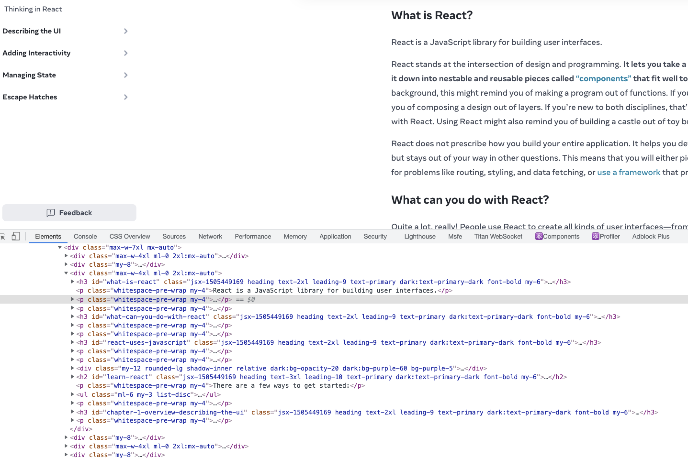
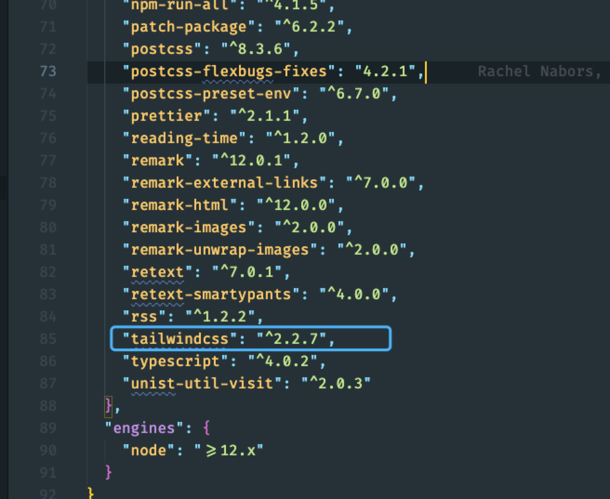
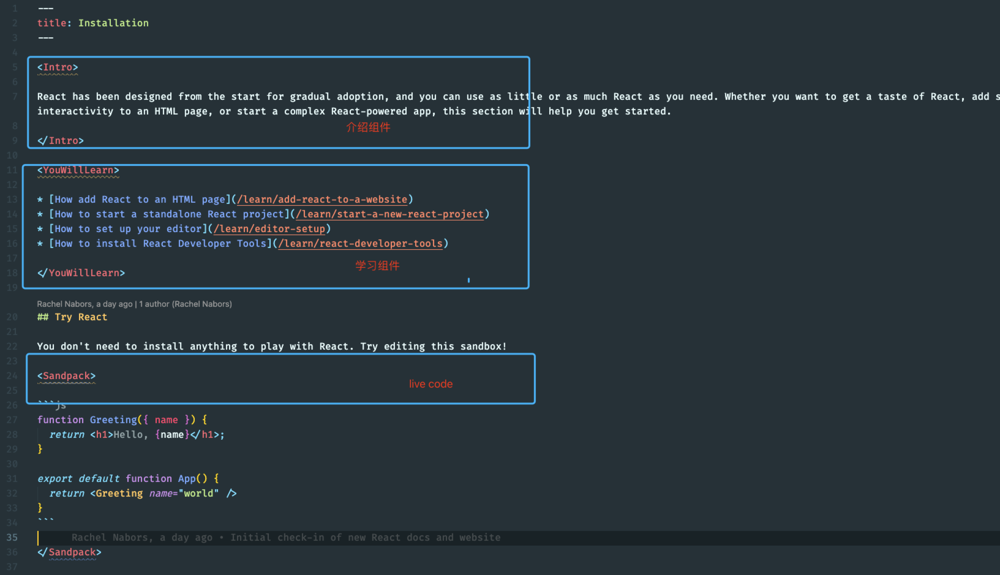

# React 新官网

react [新的官网](https://beta.reactjs.org/)已经发布了，总体分为三个部分

- [Home](https://beta.reactjs.org/) 主页信息主要是一些总览
- [Learn](https://beta.reactjs.org/learn) 一步一步的教开发者关于 React 的一些概念以及一些技巧
- [Api](https://beta.reactjs.org/reference) 主要关于 React Api 的一些知识，目前进度为 5%

总览 React 的新官网可以发现一些有趣的东西

内嵌的 live code, 每一个例子都有一个完整的 live code 方便开发人员随时修改代码查看。
自定义的 md 的样式，看起来很有意思，加强了用户的感觉。

那么最新的官网是用哪些技术实现的呢？

打开官网，可以看到元素上 css 几乎都是原子类型的 css



再看看官网最新的分支里的代码，其中有一个依赖为 tailwindcss



看来 React 官网最新的样式使用 [tailwindcss](https://tailwindcss.com/) 来写的，与时俱进。

再看看其他的依赖，新的官网使用了 Nextjs 作为主要框架，并且 live-code 使用了 [@codesandbox/sandpack-react](https://www.npmjs.com/package/@codesandbox/sandpack-react)，感兴趣的同学也可以使用这个依赖嵌套在自己的网页或者是博客之中，看起来还是很有意思的。

最新的 md 写法采用的 mdx 的方式，可以在 md 中轻松的写组件，让组件与文档结合还是一种不错的写法。这个也可以运用到自己的项目中，mdx 用法极其灵活。

以 [Installation](https://beta.reactjs.org/learn/installation) 为例子，看看这个页面在 md 中的写法是什么样的。



介绍组件是 `Intro`，学习组件使用了 `YouWillLearn`，live-code 使用了 `Sandpack`，可以分别看下这个几个组件的用法以及写法。

```tsx
function Intro({ children }: IntroProps) {
  return (
    <div className="text-xl text-primary dark:text-primary-dark leading-relaxed">
      {children}
    </div>
  )
}

Intro.displayName = 'Intro'

export default Intro
```

Intro 组件只是自定义了一些样式，直接把 children 传递下去。

`Sandpack` 组件比较复杂，感兴趣的可以切到文档的 `beta` 分支进行查看。
