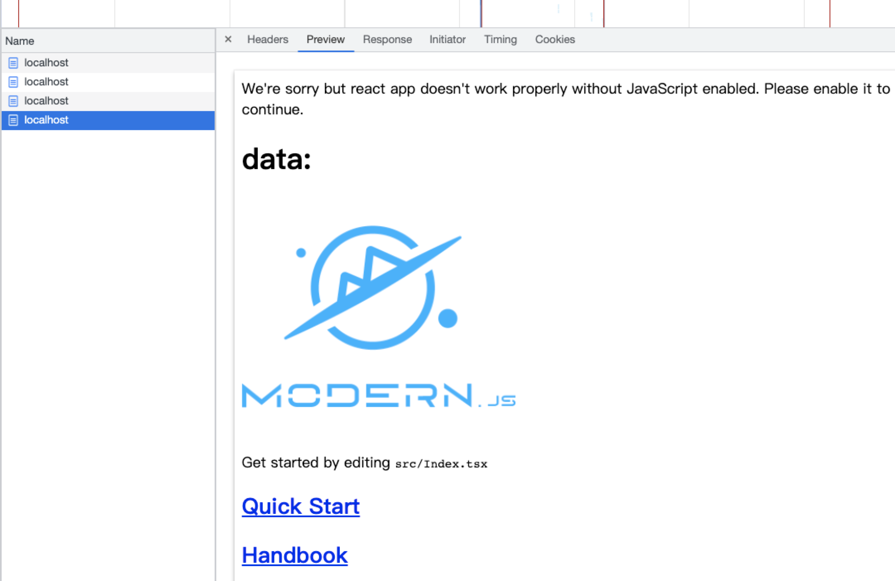
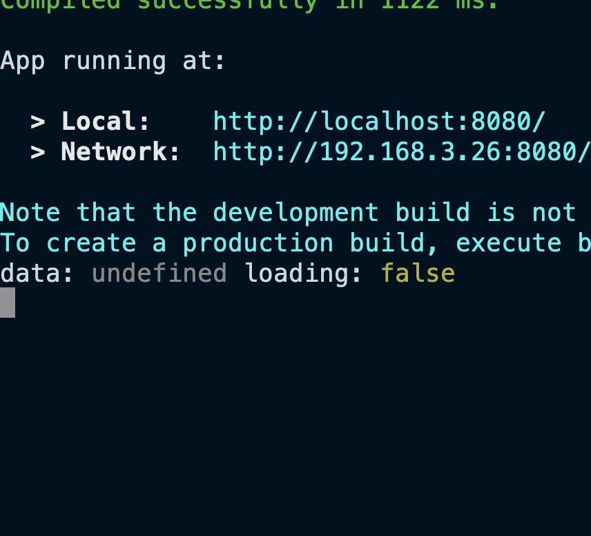
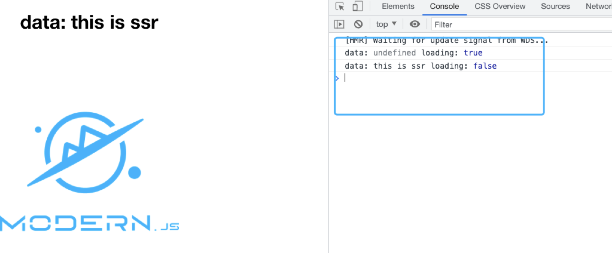

# 字节 ModernJs 的一些探索

字节跳动在 10 月份的下半旬发布了 [modernJs](https://modernjs.dev/)，很早之前字节已经在宣传 modernJs 了，但是开源后引起的反向却各不相同。

有的人说这个库就是一层一层的封装起来的库，集成了太多的功能。很多功能没有配套的设施基本很难搞。比如 SSR，SSR 结合 serverless 怎么搞，以及后续完整的发布流程都依赖
字节内部的一些平台。

当然如果对这个库感兴趣的可以试试，笔者对立面的 SSR 比较有兴趣，因为笔者也是正在做 SSR 相关的事情，顺便研究下字节开源的项目是如何做的。

如果项目开启 SSR，则需要在项目的 `package.json` 中增加一点代码：

```json{6-8}
 "modernConfig": {
    "runtime": {
      "router": true,
      "state": true
    },
    "server": {
      "ssr": true
    }
  }
```

在 `server` 选项中配置 ssr 即可。如下图所示：



那么在开启 SSR 后如何在服务端请求数据用于首屏的渲染呢？

modernJs 内部提供了一个方法叫 [useLoader](https://modernjs.dev/docs/apis/runtime/container/use-loader)。我对这个 api 感到有点奇怪，这个 api 是写在组件内部的，那就是当运行到组件的时候才会执行这个代码，而在 useLoader 内部是可以请求数据的。因此这个 api 更像是运行组件的时候去获取数据，而不是在运行组件之前。

这个有点像 React 最新的 Suspense SSR, 在渲染到 Suspense 的时候如果没有数据会显示 fallback 否则显示正确的数据。

于是我在代码中(`pages/index.tsx`)加上了这个 useLoader api

```tsx
const { data, loading } = useLoader(
  async () => {
    return await new Promise(resolve => {
      setTimeout(() => resolve('this is ssr'), 2000)
    })
  },
  { params: 13 }
)

console.log('data:', data, 'loading:', loading)
```

在首屏我们是更希望在服务端直接获取到数据，然后在客户端直接显示。现在来看看效果如何:

首先在服务端会打印出:



从上图可以看出在服务端获取到的 data 是 `undefined`，并没有等待数据获取到再进行渲染。

再看看客户端渲染的结果：



先是 `undefined`，然后获取到结果后重新渲染才是真正的值，这个看起来并没有达到在服务端预先获取到数据的作用。

但是后续再刷新的时候又发生了一个奇怪的现象是：**服务端先返回 undefined，后续又返回了新的值，看起来是在服务端运行了多次**。看一下总体的效果：


[useLoader](https://modernjs.dev/docs/guides/features/runtime/use-loader#loader-%E7%BC%93%E5%AD%98%E9%87%8D%E8%AF%95) 的文档中说明对相同的 `key` 为避免请求多次，因此进行了缓存。但是这个应该不是引起这个现象的原因。

在 `useLoader` 的内部存在一个订阅器，会把函数发送到 `loaderManger` 中进行管理。因此个人猜测出现这种情况的原因是：

在项目启动的时候相当于服务重新启动，因为在执行到组件内部时，会把相应的函数注册到 `loaderManger` 中，因此第一次返回时 `undefined`，后续再刷新页面因为服务仍然在启动，仍然属于当前进程中，内部已经存在了当前的订阅器，因此可以等待之前注册的 loader 函数执行完再进行页面的渲染。
