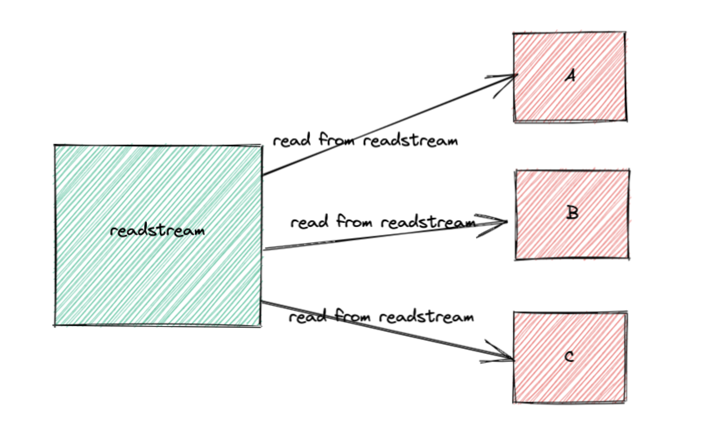
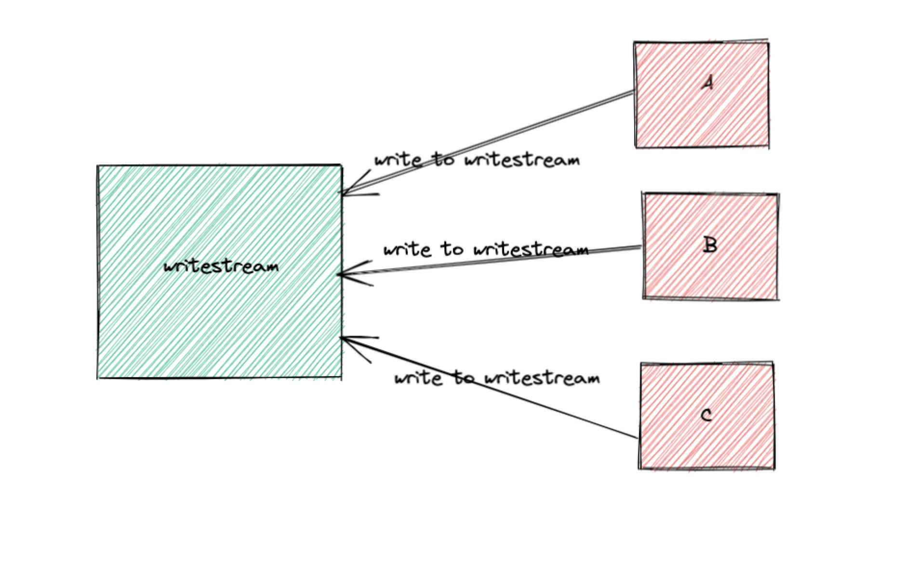
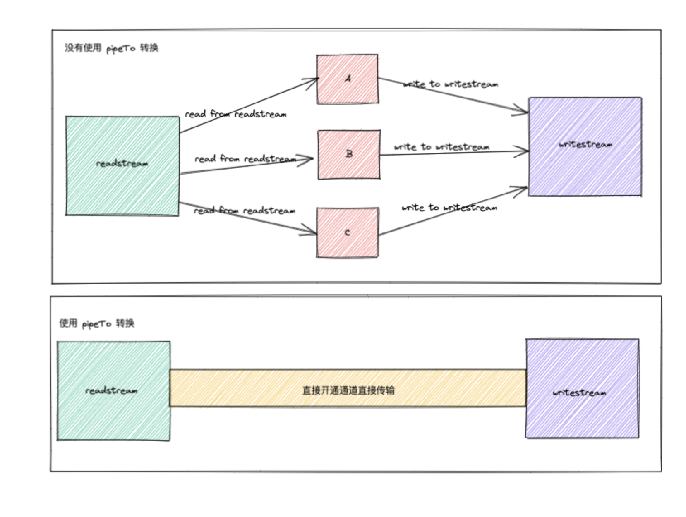

# Web Streams

这篇文章主要是对黄子毅大佬写的这篇[精读《web streams》](https://zhuanlan.zhihu.com/p/425322116)增加一些图解，我觉得黄老师这篇文章对
web streams 的解释是非常好的，通俗易懂。但是为了更加方便理解，我会在此基础上增加一些图解。

一下内容来自黄老师的文章，针对特殊部分会有图解。

一共有三种流，分别是：writable streams、readable streams、transform streams，它们的关系如下：


- readable streams 代表 A 河流，是数据的源头，因为是数据源头，所以只可读不可写。
- writable streams 代表 B 河流，是数据的目的地，因为要持续蓄水，所以是只可写不可读。
- transform streams 是中间对数据进行变换的节点，比如 A 与 B 河中间有一个大坝，这个大坝可以通过蓄水的方式控制水运输的速度，还可以安装滤网净化水源，所以它一头是 writable streams 输入 A 河流的水，另一头提供 readable streams 供 B 河流读取。

## readable streams

读取流不可写，所以只有初始化时才能设置值：

```tsx
const readableStream = new ReadableStream({
  start(controller) {
    controller.enqueue('h')
    controller.enqueue('e')
    controller.enqueue('l')
    controller.enqueue('l')
    controller.enqueue('o')
    controller.close()
  }
})
```



我们可以通过以下方式直接消费读取流：

```tsx
readableStream.getReader().read().then({ value, done } => {})
```

也可以 `readableStream.pipeThrough(transformStream)` 到一个转换流，也可以 `readableStream.pipeTo(writableStream)` 到一个写入流。

## writable streams

写入流不可读，可以通过如下方式创建：

```tsx
const writableStream = new WritableStream({
  write(chunk) {
    return new Promise(resolve => {
      // 消费的地方，可以执行插入 dom 等等操作
      console.log(chunk)

      resolve()
    })
  },
  close() {
    // 写入流 controller.close() 时，这里被调用
  }
})
```



那么 writableStream 如何触发写入呢？可以通过 `write()` 函数直接写入：

```tsx
writableStream.getWriter().write('h')
```

也可以通过 `pipeTo()` 直接对接 readableStream，就像本来是手动滴水，现在直接对接一个水管，这样我们只管处理写入就行了：

```tsx
readableStream.pipeTo(writableStream)
```


