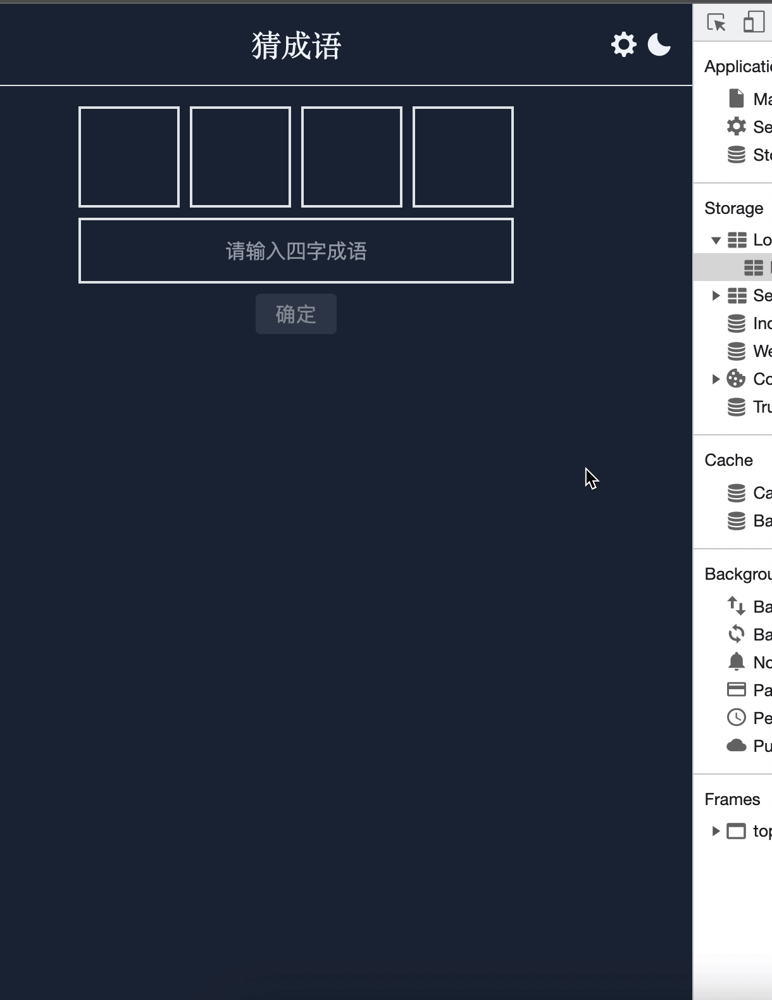
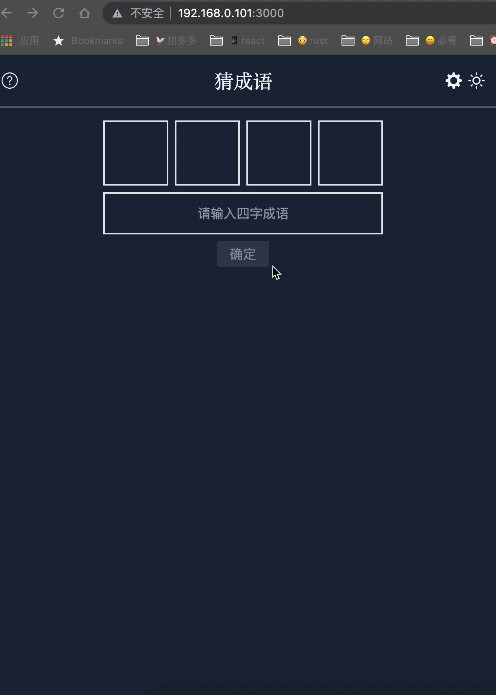

# 从 React 最新文档中学习到了什么？

react [最新版本的文档](https://beta.reactjs.org/)已经上线很久了，采用了 [Next.js](https://nextjs.org/) 开发。支持在线编辑，暗黑等相关功能。

笔者最近在使用 [react](https://beta.reactjs.org/), [remix](https://remix.run/docs/en/v1) 和 [tailwindcss](https://tailwindcss.com/) 开发[成语类的 wordle 游戏](https://github.com/snakeUni/react-chinese-wordle)。遇到了一个问题是在 ssr 场景下如何使用暗黑主题，使页面不闪动？

## SSR 如何使用暗黑模式

暗黑主题的实现，通常是把主题变量存在到 localStorage 中，当页面渲染的时候从 localStorage 中读取暗黑主题的变量同时设置对应的 class 为 dark。目前游戏是采用 remix + tailwindcss 开发的。因此暗黑模式也是参考 tailwindcss 的暗黑来设置的。比如:

```tsx
// On page load or when changing themes, best to add inline in `head` to avoid FOUC
if (
  localStorage.theme === 'dark' ||
  (!('theme' in localStorage) &&
    window.matchMedia('(prefers-color-scheme: dark)').matches)
) {
  document.documentElement.classList.add('dark')
} else {
  document.documentElement.classList.remove('dark')
}

// Whenever the user explicitly chooses light mode
localStorage.theme = 'light'

// Whenever the user explicitly chooses dark mode
localStorage.theme = 'dark'

// Whenever the user explicitly chooses to respect the OS preference
localStorage.removeItem('theme')
```

通过读取 localStorage 的 theme 来判断是否是暗黑模式，如果是暗黑模式则调用

```tsx
document.documentElement.classList.add('dark')
```

否则调用

```tsx
document.documentElement.classList.remove('dark')
```

因此组件可能是这样的(假设点击切换暗黑和亮色的 icon 是在 `Header` 组件中)

```tsx
import { useState, useEffect } from 'react'

export default function Header() {
  const [isDark, setIsDark] = useState(() => {
    if (typeof document === 'undefined') return false
    return document.documentElement.classList.contains('dark')
  })

  useEffect(() => {
    const theme = localStorage.getItem('theme')
    if (theme === 'dark') {
      document.documentElement.classList.add('dark')
    }
  }, [])

  return <header>{isDark ? <Sun /> : <Moon />}</header>
}
```

如果页面是 CSR 模式那么这里是没有问题的，页面也不会有闪动。但是如果页面是 SSR 渲染的，就会存在闪动的问题。不妨把这个组件分成两个阶段来看：

- ssr 阶段， isDark 为 false，因此页面呈现白色的底色。
- csr 阶段，isDark 可能为 true，因此页面暗色的底色。

因为存在这两个阶段，因此如果页面已经被设置为暗黑模式了，那么页面将会发生`服务端返回的白色底色 -> 客户端渲染的暗黑底色`这样的转变。



那么如何解决这个闪动的问题呢？

因为主题变量是存储在 `localStorage` 中的，在服务端是无法使用 `localStorage` 变量，只能在客户端使用。

因此如果在组件的 `useEffect` 中使用，将会出现明显的页面底色闪动，所以放在 `useEffect` 中是不行的。

那么是否可以把相关代码返给到 `useLayoutEffect` 中呢？其实是一样的，无论是放在 `useLayoutEffect 还是 useEffect` 中，都必须要先等 react 加载完成，才可以执行相应的代码逻辑。所以无论放在哪里都会出现页面闪动。

既然 `useLayoutEffect` 和 `useEffect` 都不行，那是不是暗黑模式在 SSR 中就无法实现了呢？答案是**可以的**。

我们只需要尽可能早的执行脚本，就可以避免视觉中出现闪动的现象。因为 SSR 返回的是 html 的字符串(或流式渲染)，最终会被浏览器解析成页面。那么只要保证脚本**尽可能早的执行**，是否就可以避免出现闪动的现象呢？不妨看看 react 是如何在 SSR 下实现暗黑模式的。

因为 react 文档是使用 Next.js 开发的，因此在 `_document` 文件中增加以下[脚本](https://github.com/reactjs/reactjs.org/blob/86eb509781/beta/src/pages/_document.tsx#L15-L57)

```tsx
<script
  dangerouslySetInnerHTML={{
    __html: `
        (function () {
          function setTheme(newTheme) {
            window.__theme = newTheme;
            if (newTheme === 'dark') {
              document.documentElement.classList.add('dark');
            } else if (newTheme === 'light') {
              document.documentElement.classList.remove('dark');
            }
          }
          var preferredTheme;
          try {
            preferredTheme = localStorage.getItem('theme');
          } catch (err) { }
          window.__setPreferredTheme = function(newTheme) {
            preferredTheme = newTheme;
            setTheme(newTheme);
            try {
              localStorage.setItem('theme', newTheme);
            } catch (err) { }
          };
          var initialTheme = preferredTheme;
          var darkQuery = window.matchMedia('(prefers-color-scheme: dark)');
          if (!initialTheme) {
            initialTheme = darkQuery.matches ? 'dark' : 'light';
          }
          setTheme(initialTheme);
          darkQuery.addEventListener('change', function (e) {
            if (!preferredTheme) {
              setTheme(e.matches ? 'dark' : 'light');
            }
          });
        })();
      `
  }}
/>
```

因为这个脚本是在 body 下的第一个元素，因此也会被优先解析。脚本内部是一个自执行的函数，因此在服务端返回并解析的过程中就会获取主题信息，并设置主题信息。

那么 icon 的切换是如何避免闪动的呢？可以[通过 css 来实现](https://github.com/reactjs/reactjs.org/blob/86eb509781/beta/src/components/Layout/Nav/Nav.tsx#L139-L159)，tailwindcss 支持了暗黑模式下的各种展示形式。

```tsx
<div className="block dark:hidden">
  <button
    type="button"
    aria-label="Use Dark Mode"
    onClick={() => {
      window.__setPreferredTheme('dark');
    }}
    className="hidden lg:flex items-center h-full pr-2">
    {darkIcon}
  </button>
</div>
<div className="hidden dark:block">
  <button
    type="button"
    aria-label="Use Light Mode"
    onClick={() => {
      window.__setPreferredTheme('light');
    }}
    className="hidden lg:flex items-center h-full pr-2">
    {lightIcon}
  </button>
</div>
```

在 `darkIcon` 上增加 `block dark:hidden`，在 `lightIcon` 上增加 `hidden dark:block` 来实现对应 icon 的显隐。



总结：

在 SSR 模式下使用暗黑模式主要通过以下两点

1. 尽可能早的执行脚本，通过注入的脚本实现暗黑模式。
2. icon 使用 css 的方式实现显示和隐藏。

## 扩展，js 快速实现媒体查询

在 react 文档的脚本中有这样一处代码

```tsx
var darkQuery = window.matchMedia('(prefers-color-scheme: dark)')
if (!initialTheme) {
  initialTheme = darkQuery.matches ? 'dark' : 'light'
}
setTheme(initialTheme)
darkQuery.addEventListener('change', function (e) {
  if (!preferredTheme) {
    setTheme(e.matches ? 'dark' : 'light')
  }
})
```

通过 [window.matchMedia](https://developer.mozilla.org/zh-CN/docs/Web/API/Window/matchMedia) 获取 css 中媒体查询的返回值，如果满足返回 true，否则返回 false。同时通过[注册监听器](https://developer.mozilla.org/zh-CN/docs/Web/CSS/Media_Queries/Testing_media_queries)达到实时获取返回值的效果。
