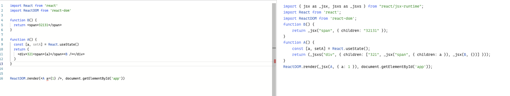

# React17

背景：

昨晚下班回家后，发现自己的项目使用的版本都是 `16.8` 的版本，虽然我一直都在关注 React 的一些动态，但是业务项目并没有去升级。正好借助这次给 React 升到 17。

既然要升级到 React 17，那么看看 React 17 相比如 16 有哪些变化。具体可以查看官方 blog [React v17.0](https://reactjs.org/blog/2020/10/20/react-v17.html)。其中的 Changelog 部分详细的说明了修改的每一个地方。但是在今天的这篇文章中主要关注其中的一个功能就是 [New JSX Transform](https://reactjs.org/blog/2020/09/22/introducing-the-new-jsx-transform.html)。

我们知道在 React 16 版本中，我们写的组件都会被转化为 `React.createElement`。比如这样的一个组件

```tsx
import React from 'react'
import ReactDOM from 'react-dom'

function B() {
  return <span>32131</span>
}

function A() {
  const [a, setA] = React.useState()
  return (
    <div>
      321<span>{a}</span>
      <B />
    </div>
  )
}

ReactDOM.render(<A a={1} />, document.getElementById('app'))
```

会被转化为

```tsx
import React from 'react'
import ReactDOM from 'react-dom'
function B() {
  return React.createElement('span', null, '32131')
}
function A() {
  const [a, setA] = React.useState()
  return React.createElement(
    'div',
    null,
    '321',
    React.createElement('span', null, a),
    React.createElement(B, null)
  )
}
ReactDOM.render(
  React.createElement(A, { a: 1 }),
  document.getElementById('app')
)
```

那这个转化操作是在哪里做的呢？是通过 [babel-plugin-transform-react-jsx](https://github.com/babel/babel/blob/main/packages/babel-plugin-transform-react-jsx/src/create-plugin.ts) 来实现的。

当 React 升级到 17 后，上述的源代码会被转换为这样

```tsx
import { jsx as _jsx, jsxs as _jsxs } from 'react/jsx-runtime'
import React from 'react'
import ReactDOM from 'react-dom'
function B() {
  return _jsx('span', { children: '32131' })
}
function A() {
  const [a, setA] = React.useState()
  return _jsxs('div', {
    children: ['321', _jsx('span', { children: a }), _jsx(B, {})]
  })
}
ReactDOM.render(_jsx(A, { a: 1 }), document.getElementById('app'))
```

从上述代码可以看出收到导入了

```tsx
import { jsx as _jsx, jsxs as _jsxs } from 'react/jsx-runtime'
```

另外之前的 `React.createElement` 会被转化为 `_jsxs` 或者是 `_jsx`。React 为什么要这么做呢？他们在相关 [rfc](https://github.com/reactjs/rfcs/blob/createlement-rfc/text/0000-create-element-changes.md#motivation) 中已经说明了原因。

其中一点令我比较好奇的就是，什么时候用 `jsx`，什么时候用 `jsxs`。带着这个疑问看了下最新的 [React 源码](https://github.com/facebook/react/blob/main/packages/react/src/jsx/ReactJSX.js)。从源码中可以看出，这个只在开发环境下回区分，在生产环境下都是使用 `jsxProd` 方法。而在开发环境下，这两个分别是

```tsx
const jsx = __DEV__ ? jsxWithValidationDynamic : jsxProd
// we may want to special case jsxs internally to take advantage of static children.
// for now we can ship identical prod functions
const jsxs = __DEV__ ? jsxWithValidationStatic : jsxProd
```

通过翻开 [ReactJSXElementValidator](https://github.com/facebook/react/blob/a59f53a603306777fc6f949d84ce85f09bba4e4c/packages/react/src/jsx/ReactJSXElementValidator.js) 代码可知，jsx 和 jsxs 的唯一区别就是是否传递了 `isStaticChildren` 参数。

```tsx
export function jsxWithValidationStatic(type, props, key) {
  if (__DEV__) {
    return jsxWithValidation(type, props, key, true)
  }
}

export function jsxWithValidationDynamic(type, props, key) {
  if (__DEV__) {
    return jsxWithValidation(type, props, key, false)
  }
}
```

那么是否传递这个参数有什么影响呢？通过查看 [jsxWithValidation](https://github.com/facebook/react/blob/a59f53a603306777fc6f949d84ce85f09bba4e4c/packages/react/src/jsx/ReactJSXElementValidator.js#L297-L410) 代码可知，唯一的区别就是

```tsx
export function jsxWithValidation(
  type,
  props,
  key,
  isStaticChildren,
  source,
  self,
) {
  if (__DEV__) {
    //...before 省略了很多逻辑
    if (validType) {
      const children = props.children;
      if (children !== undefined) {
        if (isStaticChildren) {
          if (isArray(children)) {
            for (let i = 0; i < children.length; i++) {
              validateChildKeys(children[i], type);
            }

            if (Object.freeze) {
              Object.freeze(children);
            }
          } else {
            console.error(
              'React.jsx: Static children should always be an array. ' +
                'You are likely explicitly calling React.jsxs or React.jsxDEV. ' +
                'Use the Babel transform instead.',
            );
          }
        } else {
          validateChildKeys(children, type);
        }
      }
    }
    // ...after 省略了后置逻辑
}
```

当 `isStaticChildren` 为 true 的时候会校验 children 是否是数组，如果是数组就校验子元素。通过源码可是 `isStaticChildren` 的作用，那么到底什么时候用 `jsx`，什么时候用 `jsxs` 呢？透过源码我们可以猜测如果子元素是数组就使用 `jsxs`，否则使用 `jsx`。不妨在回头看一下最新的转义的代码和源码。



从代码的前后对比很容易看出结果是符合我们的猜想的。猜想归猜想，我们还是要验证一下。

通过查看 [babel 插件的代码](https://github.com/babel/babel/blob/main/packages/babel-plugin-transform-react-jsx/src/create-plugin.ts#L544-L547)

```tsx
// Builds JSX into:
// Production: React.jsx(type, arguments, key)
// Development: React.jsxDEV(type, arguments, key, isStaticChildren, source, self)
function buildJSXElementCall(path: NodePath<JSXElement>, file: PluginPass) {
  // ...etc 前置逻辑省略
  return call(file, children.length > 1 ? 'jsxs' : 'jsx', args)
}
```

可以发现在转换的过程中会主动判断 `children.length > 1`，如果子元素的长度大于 1 则使用 `jsxs`，否则使用 `jsx`。和我们的猜测完全一致。

---

结论：

React 17 并没有实质性的 BreakChange，同时也增加了一些功能。具体相关功能都可以在他们的 blog [React v17.0](https://reactjs.org/blog/2020/10/20/react-v17.html) 找到。
