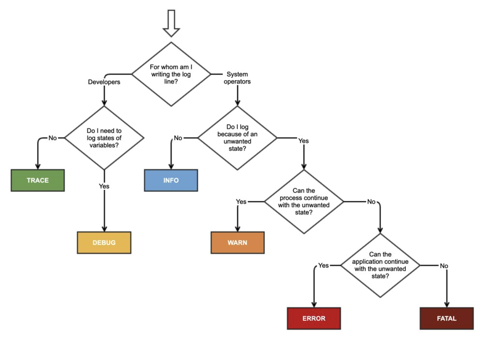

# 每日一读

## 2023-08-24

- [The underlying mechanisms of React’s concurrent mode](https://andreigatej.dev/blog/the-underlying-mechanisms-of-reacts-concurrent-mode/)

## 2023-08-11

- [干货 | 携程度假基于 RPC 和 TypeScript 的 BFF 设计与实践](https://mp.weixin.qq.com/s/JiJhA6AfNiGXl7p0uQ8mGA) RPC 和 BFF

## 2023-08-02

- [Understanding React Server Components](https://vercel.com/blog/understanding-react-server-components) 详细的讲了 RSC 的一些知识点。

## 2023-07-19

- [How React 18 Improves Application Performance](https://vercel.com/blog/how-react-18-improves-application-performance)

## 2023-07-13

- [干货 | 携程商旅大前端 React Streaming 的探索之路](https://mp.weixin.qq.com/s/HUJTU5Du6318LJ7RfQNN2g) 关于使用 React Stream 的一些心得，以及内部实现原理的解析。

## 2023-05-23

- [Am I the only one that thinks that the direction of React is wrong?](https://www.reddit.com/r/reactjs/comments/13n9zny/comment/jl5vcix/?utm_source=reddit&utm_medium=web2x&context=3) Dan 的完整的回答

## 2023-04-19

- [负责淘宝业务前端开发 9 年，聊聊我的心得](https://mp.weixin.qq.com/s/lykixH0ceCALRiLGUQPslA) 一篇比较好的文章来

## 2023-04-10

- [A Complete Visual Guide to Understanding the Node.js Event Loop](https://www.builder.io/blog/visual-guide-to-nodejs-event-loop)

## 2023-03-12

- [serviceworker 运用与实践](https://mp.weixin.qq.com/s/jUwH8AM5OS-k_OeZTE5sgA)

## 2023-03-11

- [Integrating Remix Router with React Transitions](https://github.com/remix-run/remix/issues/5763)

## 2023-03-06

- [Demystifying Create React Signals Internals](https://blog.axlight.com/posts/demystifying-create-react-signals-internals/) Dai shi 对 signal 的探索还是蛮多的。

## 2023-03-04

- [React Server Components anything](https://twitter.com/dan_abramov/status/1631641431742857216) Dan 回答了关于 RSC 的一些提问，值得去看。

## 2023-03-02

- [React vs Signals: 10 Years Later](https://dev.to/this-is-learning/react-vs-signals-10-years-later-3k71) 讲述了 solid 中的 signal 以及 React 坚持不使用 signal。说实话有点踩 React 捧自己 solid 框架的倾向。回复也值得看

## 2023-02-26

- [how pnpm links](https://zhuanlan.zhihu.com/p/609430861) 一篇非常棒的文章，关于 pnpm 是如何工作的

## 2023-02-25

- [Connection to Signals](https://vuejs.org/guide/extras/reactivity-in-depth.html#rxjs) vue 中关于 Signals 的一些对比

## 2023-02-23

- [从零开始撸一个「响应式」框架](https://juejin.cn/post/7201314551576690749) 写的不错的一篇文章

## 2023-02-17

- [TypeScript: Union to intersection type](https://fettblog.eu/typescript-union-to-intersection/) 深度了解 TS 交集和并集

## 2023-02-13

- [字节前端监控实践](https://juejin.cn/post/7195496297150709821) 字节前端监控

## 2023-02-11

- [\*React 的前世今生](https://www.youtube.com/watch?v=8pDqJVdNa44)

## 2023-02-06

- [Replace Create React App recommendation with Vite](https://github.com/reactjs/reactjs.org/pull/5487#issuecomment-1409720741) Dan 讲述了 CRA 的前世今生，并给出了 CRA 最终的方向。

## 2023-01-29

- [Zod: The Next Biggest thing after Typescript](https://dev.to/jareechang/zod-the-next-biggest-thing-after-typescript-4phh) zod 实现了类型和 schema 的互相转换。
- [花了好几个小时，终于懂了什么叫 SWR](https://juejin.cn/post/7192467269316788280) 讲的确实不错，结论如下
  - max-age 内直接读取缓存，不会请求服务器。
  - max-age ~ max-age + swr 之间，会读取缓存的同时，在后台请求更新缓存。
  - max-age + swr 后，请求会直接打到服务器，返回最新的内容。
- [Stale-while-revalidate](https://developer.chrome.com/docs/workbox/caching-strategies-overview/#stale-while-revalidate) 一张图解释 swr

## 2023-01-28

- [How to debounce and throttle in React without losing your mind](https://www.developerway.com/posts/debouncing-in-react) 实现一个 debounce hook
- [Optimize Time to First Byte](https://web.dev/optimize-ttfb/)

## 2023-01-10

- [Handling errors like a pro in TypeScript](https://engineering.udacity.com/handling-errors-like-a-pro-in-typescript-d7a314ad4991) 如果设置错误，这种经常会在后端出现定义自己的错误格式。前端也可以定义自己的错误格式。
- [为 iframe 正名，你可能并不需要微前端](https://juejin.cn/post/7185070739064619068) 是否需要微前端根据自己的业务来判断。

## 2023-01-04

- [Why React Re-Renders](https://www.joshwcomeau.com/react/why-react-re-renders/) 一篇写的非常不错的文章

## 2023-01-03

- [从 0 到 1：美团端侧 CDN 容灾解决方案](https://tech.meituan.com/2022/01/13/phoenix-cdn.html) 有时资源会加载失败，但是加载失败了却无法很好的做出应对之策，因此需要对资源做好监控以及对应的容灾策略。

---

# 2022 年集合

## 2022/12/22

- [HTML Attribute VS DOM Property](https://dotnettutorials.net/lesson/html-attribute-vs-dom-property/) React 也是对齐的是 Dom Property
  这也就回答了为啥使用的是 classname 而不是 class

## 2022/12/08

- [React Streaming SSR 原理解析](https://mp.weixin.qq.com/s/GVts2QW3H_aTrB9anGwl5g) 从源码角度讲解了 SSR 的原理

## 2022/12/07

- [React Conditional Rendering With Type Safety and Exhaustive Checking](https://www.lloydatkinson.net/posts/2022/react-conditional-rendering-with-type-safety-and-exhaustive-checking/)

## 2022/11/30

- [Modern web debugging in Chrome DevTools](https://developer.chrome.com/blog/devtools-modern-web-debugging/)

## 2022/11/28

- [基于 Module Federation 的模块化跨栈方案探索｜ 得物技术](https://mp.weixin.qq.com/s?__biz=MzkxNTE3ODU0NA==&mid=2247490593&idx=1&sn=b147737622d42e7d0589ec7973cc5737&chksm=c162497ef615c0680f31370f49832e116646eb6e82a471be0ac600d5e13186421096b9b4e5c0&scene=132#wechat_redirect) 得物的模块联邦技术

## 2022/11/18

- [抓包理解 DNS 流程和 CDN 原理](https://zhuanlan.zhihu.com/p/584431040)

## 2022/11/16

- [重新理解 Web](https://zhuanlan.zhihu.com/p/581977751) 对 web 比较好的一次科普了。

## 2022/11/15

- [从 React 源码彻底搞懂 Ref 的全部 api](https://zhuanlan.zhihu.com/p/583741032) 一篇比较好的文章，解析了 react 几个 api。

## 2022/11/14

- [deferred data](https://reactrouter.com/en/main/guides/deferred) 使用 defer 后，数据请求方式会从 `document -> JavaScript -> Lazy Loaded Route -> data fetch` => `document -> JavaScript -> Lazy Loaded Route & data (in parallel)`

## 2022/11/11

- [基于 MF 的组件化共享工作流](https://mp.weixin.qq.com/s/u5oAcIYiGrl1qOujOYjzqw) 组件共享一个很好的方案

## 2022/11/05

- [Request.cache](https://developer.mozilla.org/zh-CN/docs/Web/API/Request/cache) fetch 携带 cache

## 2022/10/27

- [为什么说 90% 的前端不会调试 Ant Design 源码](https://juejin.cn/post/7158430758070140942) 这是一篇涉及多个知识点的的文章。

## 2022/10/26

- [Introducing Turbopack: Rust-based successor to Webpack](https://vercel.com/blog/turbopack) 期待 turbopack

## 2022/10/22

- [字节前端监控 SDK 体积与性能优化实践](https://mp.weixin.qq.com/s/FZUTFvOutS5NvURjj9jOFA) 开发中容易忽略注入的第三方脚本对性能的影响。

## 2022/10/21

- [【第 2759 期】异步分片计算在腾讯文档的实践](https://mp.weixin.qq.com/s/d5M_-8XqFGYnpif7GQNmLA) 一个比较好的实现一个简单的分片。

## 2022/10/14

- [通天塔页面搭建提效揭秘：设计稿自动生成楼层](https://mp.weixin.qq.com/s/aB8BEABKCPRBMwD_z6r2Gw) 通天塔是如何做搭建的。

## 2022/10/13

- [改了 3 个字符，10 倍的沙箱性能提升？！！](https://mp.weixin.qq.com/s/gwFH_48rMoUIdOvNpqvo3g) qiankun 沙箱性能提升。

## 2022/10/12

- [The Web’s Next Transition](https://www.epicweb.dev/the-webs-next-transition) 详细讲述了 web 的发展，以及各自的优缺点。

## 2022/10/10

- [解决页面间体验问题的纯前端容器 Lath](https://mp.weixin.qq.com/s/tMVSOHi7tH_c6NEVsbMVSQ) 用户体验问题一直都是很重要的一个点，从容器角度来解决各种不好解决的问题。

## 2022/10/09

- [When to use the different log levels](https://stackoverflow.com/questions/2031163/when-to-use-the-different-log-levels) log 什么时候去使用



## 2022/10/07

- [How I am so productive](https://kentcdodds.com/blog/how-i-am-so-productive) kent 是如何安排一天并保持高效的。
- [最详细的 Module Federation 的实现原理讲解](https://juejin.cn/post/7151281452716392462) MF 讲解的蛮详细的。

## 2022/10/06

- [谈谈 JS 二进制：File、Blob、FileReader、ArrayBuffer、Base64](https://zhuanlan.zhihu.com/p/568915443) 一个比较不错的文章对一些二进制对象的介绍

## 2022/09/27

- [The new wave of Javascript web frameworks](https://frontendmastery.com/posts/the-new-wave-of-javascript-web-frameworks/) js 框架的过程。

## 2022/09/26

- [为什么 B 站的弹幕可以不挡人物](https://juejin.cn/post/7141012605535010823) 巧妙的 css 属性 `mask-image` 来实现遮挡的效果

## 2022/09/25

- [React 18 vs 17 benchmarks](https://www.reddit.com/r/reactjs/comments/xmr9tg/comment/ippsuin/) Dan 说明了 18 和 17 的区别。

## 2022/09/23

- [Remesh 介绍：用以开发大型复杂 Web App 的 DDD 框架](https://mp.weixin.qq.com/s/Xur4s28bmqGsxV7f4d2GZQ) Remesh 框架的介绍

## 2022/09/20

- [做了 6 年程序员，我学到的 10 条经验](https://lutaonan.com/blog/things-i-learnt-after-6-years-as-software-engineer/) 写的很棒,保持着一颗敬畏之心。

## 2022/09/14

- [京东零售平台：前端组件资源共享与中心化管理实践](https://mp.weixin.qq.com/s/tZpf6aG3x6yOmajYAaPuAg) 如何实现组件的分享，讲的非常的清晰，很多团队值得一试。

## 2022/08/17

- [Parsing command line arguments with util.parseArgs() in Node.js](https://2ality.com/2022/08/node-util-parseargs.html)

## 2022/08/15

- [什么是前端差异化竞争？来看看 Astro](https://mp.weixin.qq.com/s/oJUMrqZ02JUQOd60s4vrAg) Astro 实现了部分注水，追求性能的极致体验。比较适合内容类的站点。
- [Islands Architecture](https://jasonformat.com/islands-architecture/) 孤岛架构。

## 2022/08/13

- [Bundle-less 的思考和实践分享](https://mp.weixin.qq.com/s/nk5SN8AKwyFkUTEOiLCBdQ)

## 2022/08/12

- [React Suspense 数据请求支持](https://github.com/facebook/react/pull/25084/files)

## 2022/07/22

- [如何提升前端线上问题发现率？我们是这样做的](https://mp.weixin.qq.com/s/rPrSPIfgKG2VfAvf5DXvTA)

## 2022/07/18

- [Node.js: checking if an ESM module is “main”](https://2ality.com/2022/07/nodejs-esm-main.html)

## 2022/07/15

- [性能提升 30%以上, JDHybrid h5 加载优化实践](https://juejin.cn/post/7120045012494057479) 原生是荣如何助力 H5 实现性能的提升的。

## 2022/06/30

- [How We Built Hydrogen: A React Framework for Building Custom Storefronts](https://shopify.engineering/how-we-built-hydrogen) 建造高性能的框架基于 React 的一些技术。

## 2022/06/07

- [如何基于 UDP 协议实现可靠传输？](https://zhuanlan.zhihu.com/p/524824554) 对 UDP 讲解的非常棒。

## 2022/06/06

- [用 Node.js 手写一个 DNS 服务器](https://zhuanlan.zhihu.com/p/524465089) 一篇非常棒的文章写关于 DNS 的解析过程，以及如何实现这样一个过程。

## 2022/06/02

- [遇到过 ESM 与 CJS 转换时的 default 问题么？](https://mp.weixin.qq.com/s/z8ee6V43xpBKNjP1-ydEqw)
- [前端安全之 CSRF 攻击原理和防护方法](https://zhuanlan.zhihu.com/p/522562168) 写的非常棒

## 2022/05/24

- [Layouts RFC](https://nextjs.org/blog/layouts-rfc) NextJs 支持嵌套式的 layout 路由。蛮好的。

## 2022/05/10

- [Scroll，你玩明白了嘛？](https://mp.weixin.qq.com/s/EhD8YIh8yAGRgXcibeEFsw) 对 scroll 的几种行为分析的很好。
- [【访谈实录】对话 Lee Robinson ：聊聊前端的未来 & Vercel](https://mp.weixin.qq.com/s/65_fvL6to9HQyMZEtrvldw) 强烈建议阅读，写的非常棒。

## 2022/04/21

- [我在淘宝做弹窗，2022 年初的回顾与展望](https://mp.weixin.qq.com/s/fIOo1bWlvKLxcjhFJjtSSg) 一篇非常好的文章关于一个做一个产品从 0 到 1 的过程。

## 2022/04/19

- [你不知道的 React v18 的任务调度机制](https://mp.weixin.qq.com/s/qyr6MnPtvnELDSbPJ2VtIw)

## 2022/04/13

- [深入浅出前端监控](https://mp.weixin.qq.com/s/lwsfTGMasiITT3khmrsfqA) 对前端监控感兴趣的可以看看，蛮不错的。

## 2022/04/01

- [DeepKit：基于 TypeScript 的颠覆性新兴 Web 框架](https://zhuanlan.zhihu.com/p/490924660) 将 ts 运用于运行时。
- [Code Kitchen：一个支持多文件与私有库的离线 React Playground 方案](https://mp.weixin.qq.com/s/3a_744VivmnpzrkGs3pW8g) 既然其他的 playground 方案满足不了，不如自己造一个。

## 2021/03/31

- [Gaining security and privacy by partitioning the cache](https://developer.chrome.com/blog/http-cache-partitioning/) 缓存策略的改变。一篇非常好的文章介绍 chrome 缓存策略的转换。总结如下：

- Chrome: Uses top-level scheme://eTLD+1 and frame scheme://eTLD+1
- Safari: Uses [top-level eTLD+1](https://webkit.org/blog/8613/intelligent-tracking-prevention-2-1/)
- Firefox: [Planning to implement](https://bugzilla.mozilla.org/show_bug.cgi?id=1536058) with top-level scheme://eTLD+1 and considering including a second key like Chrome

## 2022/03/30

- [React v18.0](https://reactjs.org/blog/2022/03/29/react-v18.html) React18 发布。

## 2022/03/28

- [为自己的团队定制 CSS 框架](https://www.yuque.com/luchen/buzhou/bs9tzt) 写的蛮好的，尤其是结合 css-modules
- [如何从一个技术高手转技术管理？](https://www.21cto.com/article/how-to-transfer-from-a-technical-master-to-technical-management) 打开格局，抓大放小。抓重避轻。

## 2022/03/27

- [微服务前端数据加载的最佳实践](https://zhuanlan.zhihu.com/p/351044054) 关于微服务下前端数据加载的最佳实践，写的很棒。

个人看了这篇文章，也总结一下使用 BFF 的有点和缺点。

优点

1. 接口整合。
2. 加入缓存。需要记得加入缓存淘汰机制。和 localStorage 处理一样，可以采用 LRU 的算法来处理。(需要考虑多实例情况，因为在服务端，可能缓存只存在于一个实例上，如果命中另外一个实例，则无法读取缓存，所以需要一个统一的缓存处理机制)。还需要考虑到[缓存击穿，缓存雪崩和缓存穿透](https://zhuanlan.zhihu.com/p/359118610)。

缺点：

1. 占用服务资源，可能会导致资源的浪费。
2. 调试很难，一旦出问题，需要调试多处。
3. 容灾处理。

## 2022/03/26

- [一文彻底搞懂前端沙箱](https://mp.weixin.qq.com/s?__biz=Mzk0MDMwMzQyOA==&mid=2247493311&idx=1&sn=701ca8e88f02a028d653431a2d752a37&scene=21#wechat_redirect) 文章偏长，最新的标准沙箱应该是 Realm
- [Upgrading Next.js for instant performance improvements](https://vercel.com/blog/upgrading-nextjs-for-instant-performance-improvements)

## 2022/03/24

- [View the formatted RFC.](https://github.com/reactjs/rfcs/blob/suspense-18/text/0000-suspense-in-react-18.md) React18 新的 `Suspense` API，相比于旧的改了不好。并且支持最新的 `stream` 渲染了。相关 [pr](https://github.com/reactjs/rfcs/pull/213)
- [React18 RFC](https://github.com/reactjs/rfcs/blob/react-18/text/0000-react-18.md) React18 的 RFC。介绍了关于即将发布的 18 版本一些 feature。

## 2022/03/23

- [Running commands with execa in Node.js](https://blog.logrocket.com/running-commands-with-execa-in-node-js/) 通过 execa 执行命令
- [为什么 try catch 能捕捉 await 后 promise 错误？ 和执行栈有关系吗？](https://www.zhihu.com/question/522726685) 高分回答为什么 promise 被 await 后就可以被上层的 try catch 捕获了。而原始 promise 的回调中如果出现错误并不会被捕获，这个和 setTimeout 抛错是同理的。比如

```ts
try {
  throw new Error('111')
} catch (error) {
  console.log('error:', error)
}
```

此时的错误可以被捕获到，但是改成这样

```ts
try {
  setTimeout(() => {
    throw new Error('111')
  })
} catch (error) {
  console.log('error:', error)
}
```

就捕获不到了。

## 2022/03/22

- [Tao of Node - Design, Architecture & Best Practices](https://alexkondov.com/tao-of-node/) 关于 node 的一个教程。

## 2022/03/19

- [关于电竞职业选手转前端开发这件事](https://juejin.cn/post/7076377297623711757) 推荐阅读，很激励别人。

## 2022/03/18

- [在字节跳动做在线文档的那些事儿](https://mp.weixin.qq.com/s/wLSurUk2WY8kQtpwR0yRlg) 对文档感兴趣的话可以看看。

## 2022/03/06

- [从 0 到 1：美团端侧 CDN 容灾解决方案](https://tech.meituan.com/2022/01/13/phoenix-cdn.html)

## 2022/02/28

- [Improving Web Performance with React Hydration Strategies](https://medium.com/cdiscount-engineering/improving-web-performance-with-react-hydration-strategies-3117f71a1695) 作者讲解了 hydrated 的几个策略，渐进式的注水比较容易实现。

## 2022/02/27

- [Optimizing third-party script loading in Next.js](https://web.dev/script-component/) Next.js 是如何优化第三方脚本的。

## 2022/02/24

- [前端 Leader 如何做好团队规划？阿里内部培训总结公开](https://zhuanlan.zhihu.com/p/36911993) 作者从多个方面介绍了如何做好团队规划。

## 2022/02/23

- [谈谈性能优化 - 从用户体验聊起](https://mp.weixin.qq.com/s/SU2PGcssUTwmDzw8qzt9VA) 性能优化不仅是速度快，用户其他的体验也极其重要。

## 2022/02/22

- [Event Collector —— Web 环境的标记埋点方案](https://juejin.cn/post/7067087906124333087) 一个标记埋点的不错的方案。

## 2022/02/21

- [monorepo.tools](https://monorepo.tools/) monorepo 工具的对比。

## 2022/02/19

- [Facebook 工程师文化独特之处](https://zhuanlan.zhihu.com/p/468644178) 很多时候技术应该和产品的目标是一致的。

## 2022/02/18

- [Why Efficient Hydration in JavaScript Frameworks is so Challenging](https://dev.to/this-is-learning/why-efficient-hydration-in-javascript-frameworks-is-so-challenging-1ca3) 作者谈论 SSR 中有哪些方法可以提升性能。

## 2022/02/17

- [为什么大厂前端监控都在用 GIF 做埋点？](https://juejin.cn/post/7065123244881215518) 解释了埋点系统用 GIF 的原因
- [弄懂 SourceMap，前端开发提效 100%](https://zhuanlan.zhihu.com/p/467566753) 对 SourceMap 讲的非常细致的一篇了。
- [如何为 Node.js 的 require 函数添加钩子？](https://mp.weixin.qq.com/s/BFu4SouMdXFYLELRjHhUyg) 本文讲述了如何劫持 require 函数。包括 yarn pnp 也都对 require 进行了相关劫持。

## 2022/02/15

- [我的前端性能优化知识体系](https://juejin.cn/post/7063754993072865287) 一篇比较好的对性能指标的介绍。

## 2022/03/10

- [A Proposal For Type Syntax in JavaScript](https://devblogs.microsoft.com/typescript/a-proposal-for-type-syntax-in-javascript/) 最新的提议，js 中支持类型，很是期待。
- [proposal-types-as-comments](https://github.com/giltayar/proposal-types-as-comments) 相关提议。

## 2022/02/10

- [动手打造一款 canvas 排版引擎](https://zhuanlan.zhihu.com/p/464845135)

## 2022/02/07

- [技术人的产品观](https://mp.weixin.qq.com/s/qPJU_WhFxgzPVXR9oUdKhg) 通用知识和领域知识同等重要，领域知识可以让你走的更远。
- [产品：换了个人设，多卖 8 倍货！3 个行动点有效促进私域成交！](https://mp.weixin.qq.com/s?__biz=MjM5NDQ5MjUyMA==&mid=2651414497&idx=1&sn=d149324014f4a9db03be7b110e0dc8b1&chksm=bd7b06e68a0c8ff02404ddf8d4e6a370f4a81dc37ea43fe51ea9af1420daf909a2323e467586&scene=132#wechat_redirect) 如何去做私域。

## 2022/01/29

- [浅谈 Node.js 热更新](https://zhuanlan.zhihu.com/p/460359101)

## 2022/01/28

- [腾讯企鹅辅导 H5 性能极致优化](https://mp.weixin.qq.com/s?__biz=MzI1ODE4NzE1Nw==&mid=2247490349&idx=1&sn=139c52fb354eba09c0c3c5a92dc5ffa2&chksm=ea0d51d7dd7ad8c1be5be5b17fd79f5ccc8d84fe013040232a0861290728112c75fb6061499f&scene=21#wechat_redirect) 优化部分写的很赞，目前页面还不是 SSR 直出，然而效果已经很棒了。
- [做了两年前端 leader 后我想说几句](https://mp.weixin.qq.com/s?__biz=MzI1ODE4NzE1Nw==&mid=2247487870&idx=1&sn=a67b4b10cdd809017f0992b78252210b&chksm=ea0d5b84dd7ad2927fb5d1e41882e9e801fc5e9a38c8aeadf190cae765f8472676da0df5cdee&scene=178&cur_album_id=1806166719669796864#rd) 作为一个前端 leader 的总结。

## 2022/01/27

- [React 体系下关于 MobX 与 Redux 的一些思考](https://zhuanlan.zhihu.com/p/461844358) 很好的讲解了关于不可变和可变引起的优劣势。
- [Node 案发现场揭秘 —— 未定义 “window” 对象引发的 SSR 内存泄露](https://zhuanlan.zhihu.com/p/461945753) 作者讲述了排查的过程。
  - [I. 三种比较典型的内存泄漏](https://cnodejs.org/topic/58eb5d378cda07442731569f)
  - [浅谈 Node.js 热更新](https://zhuanlan.zhihu.com/p/460359101)
- [电商前端技术团队的年度总结](https://juejin.cn/post/7057439721080750087) 总结的比较不错的一篇文章，从性能，体验，业务多个方向出发来解决实际场景遇到的问题。
- [又过年了，盘一盘近一年阅读量最高的十篇文章](https://mp.weixin.qq.com/s/c-fJO_VEdvLsk2m-zRMRGg) 每一篇文章都值得去看。

## 2022/01/25

- [React: Event Bubbling and Capturing](https://www.robinwieruch.de/react-event-bubbling-capturing/) 在 React 中的事件冒泡和事件捕获。

## 2022/01/24

- [Vitekit](https://egoist.sh/building-vitekit-1) 作者计划 14 天手写 Vitekit，其 kit 命名来自 SvelteKit。对于这个话题还挺感兴趣，但是到第二天貌似就断更了。
- [TypeScript 4.6 Beta](https://devblogs.microsoft.com/typescript/announcing-typescript-4-6-beta/)

## 2022/01/21

- [大规模 Node.js 网关的架构设计与工程实践](https://mp.weixin.qq.com/s/1lcf_3lN4PNbRPj5tAba2w)
- [How React server components work: an in-depth guide](https://blog.plasmic.app/posts/how-react-server-components-work/)

## 2022/01/17

- [Parcel CSS](https://parceljs.org/blog/parcel-css/) Parcel 组织的新产品，可以用于 Parcel，也可以和其他工具集成使用。基于 Rust，速度比 cssnano 快 100 倍，比 esbuild 快 4 倍，同时产物尺寸也更小。


## 2022/01/13

- [不优雅的 React Hooks](https://zhuanlan.zhihu.com/p/455317250) 本文阐述了使用 Hooks 引起的一些问题，但是任何事情都是有两面性的，客观的去看待，不同的场景使用不同的技术。

## 2022/01/12

- [深入浅出 tnpm rapid 模式 - 如何比 pnpm 快 10 秒](https://zhuanlan.zhihu.com/p/455809528)

## 2022/01/11

- [SEE Conf: Umi 4 设计思路文字稿](https://mp.weixin.qq.com/s/FTZ93pScf3gykd39voEpng) 对 umi4 有个详细的介绍。

## 2022/01/07

- [2022 年如何成为一名优秀的大前端 Leader](https://zhuanlan.zhihu.com/p/453878901)

## 2021/12/31

- [从实现原理看低代码](https://zhuanlan.zhihu.com/p/451340998) 对低代码一个很好的阐述

## 2021/12/21

- [D2 分享 - ESM Bundleless 在低代码场景的实践](https://mp.weixin.qq.com/s/LFMWpxPU2GceWX48r3keXQ) 低代码下的 bundleless

## 2021/12/20

- [无组件架构：你不需要知道的“新一代”前端架构模式](https://zhuanlan.zhihu.com/p/447382575)
- [A Complete Guide to React Router: Everything You Need to Know](https://ui.dev/react-router-tutorial/) 一个比较完美的对路由的解释

## 2021/12/13

- [Linux 硬链接和软连接的区别与总结](https://xzchsia.github.io/2020/03/05/linux-hard-soft-link/) 一张图足以说明一切

## 2021/11/28

- [Linux I/O 基本原理](https://zhuanlan.zhihu.com/p/436292700) 文章详细的讲解了 Linux I/O 的原理，值得一看。
- [聊聊 JS 的二进制家族：Blob、ArrayBuffer 和 Buffer](https://zhuanlan.zhihu.com/p/97768916) 详细讲解了 Blob、ArrayBuffer 和 Buffer 以及他们之前的区别和联系。

## 2021/11/16

- [RUST 是 JavaScript 基建的未来](https://zhuanlan.zhihu.com/p/433300816)

## 2021/11/15

- [一个专业的 Node.js 工程师， 需要了解下如何做好日志](https://mp.weixin.qq.com/s?__biz=MzIyNDU2NTc5Mw==&mid=2247498439&idx=1&sn=85fdb4250dc9f1d57bef26acd21b23b2&chksm=e80fb589df783c9f6225b463f2c212c85d8eb3e49be21a02827c0632df476b63edd3620513a1&scene=132#wechat_redirect)
- [精读《web streams》](https://zhuanlan.zhihu.com/p/425322116)

## 2021/10/18

- [在微前端中加载 Vite 应用](https://mp.weixin.qq.com/s?__biz=MzI5NjM5NDQxMg==&mid=2247494512&idx=1&sn=cce6c9b65493ab4888f0721bd997932e)

## 2021/10/07

- [Vite build](https://patak.dev/vite/build.html) 对 vite 进行了大概的讲解，尤大推荐。

## 2021/08/04

- [傻傻的，3 行代码一个订阅发布中](https://juejin.cn/post/6991992950876028959?from=main_page) 一个非常有意思的实现发布订阅的文章

## 2021/07/28

- [A Deep Dive into Airbnb’s Server-Driven UI System](https://medium.com/airbnb-engineering/a-deep-dive-into-airbnbs-server-driven-ui-system-842244c5f5) 服务驱动 UI，本质上就是把 schema 映射为对应平台的 UI
- [Vue.js 作者尤雨溪: 框架设计就是不断地舍取](https://mp.weixin.qq.com/s/xYn2A3MAjDRpZMSvB9IUWQ) 框架设计就是不断地取舍

## 2021/07/16

- [面向未来与浏览器规范的前端 DDD 架构设计](https://mp.weixin.qq.com/s/Br4cYZ1UDqwcBRKQTBqsMw) 字节的微前端框架

## 2021/07/14

- [深入理解 Vue3 Reactivity API](https://zhuanlan.zhihu.com/p/146097763) 对响应式 API 的一个非常完整的解释。

## 2021/07/12

- [export-default-thing-vs-thing-as-default](https://jakearchibald.com/2021/export-default-thing-vs-thing-as-default/) export default 以及 import 的一些区别

## 2021/07/08

- [GMTC 2021 演讲 《字节跳动基于 Serverless 的前端研发模式升级》](https://mp.weixin.qq.com/s/J2fHm_mR7UE65q1vSQ9xpA) 字节前端研发模式的改变，干货满满

## 2021/06/19

- [progressive-rendering-frameworks-samples](https://github.com/GoogleChromeLabs/progressive-rendering-frameworks-samples) 谷歌的渐进式 ssr 的例子，看起来很有意思，通过内部实现了一个 `Hydrated` 组件，通过 `IntersectionObserver` 来监控，出现的时候再进行注水，重点可以参考[这段代码](https://github.com/GoogleChromeLabs/progressive-rendering-frameworks-samples/blob/master/react-progressive-hydration/app/components/hydrator.js#L23-L31)

## 2021/06/16

- [三种前端实现 VR 全景看房的方案！说不定哪天就用得上！](https://juejin.cn/post/6973865268426571784) 教你如何做出一个全景 VR。
- [一次千万级流量的 618 电商 H5 活动页干货分享](https://juejin.cn/post/6973922659125952548) 活动页的分享，干货满满。

## 2021/06/15

- [iMove 基于 X6 + form-render 背后的思考](https://mp.weixin.qq.com/s/EIs35ZrU05Mb2sqbifz5dA) 讲了 imove 的原理, 对流程以及低代码感兴趣的可以看看

## 2021/06/13

- [京东出品微前端框架 MicroApp 介绍与落地实践](https://mp.weixin.qq.com/s/6A6TqQpWgN1_KoxUMx3FFw) 京东的微前端框架，看起来解决了更多的问题相比 qiankun, single-spa
- [B 端产品可用性度量评估体系](https://mp.weixin.qq.com/s/nNEaev-NjnF9Em_9D4rhaA) 针对提升用户体验的目标拆解出相应的指标，从而完成相应的度量。

## 2021/06/10

- [useMutableSource](https://zhuanlan.zhihu.com/p/379340340) 对 `useMutableSource` 讲的很赞的一篇文章

## 2021/06/08

- [CLEVER VS INSIGHTFUL CODE](https://www.hillelwayne.com/post/cleverness/) people can build expertise with more expressive specs, and when they need advanced verification they know enough to write insightful specs.

## 2021/06/03

- [渐进式 Unbundled 开发工具探索之路](https://mp.weixin.qq.com/s/NH46ffu79ks57AGKd1WKMw) 与 vite 类似。

## 2021/05/25

- [工作五年反思](https://zhuanlan.zhihu.com/p/374777591) 非常值得看的一篇文章，专注于几件事，做好那么几件事就够了，没有人记得第二，只有第一。

## 2021/05/22

- [浏览器文件系统](https://web.dev/file-system-access/) 可以通过非 input 的方式操作文件，目前这个 api 各个浏览器还未支持，但是可以使用 [browser-fs-access](https://github.com/GoogleChromeLabs/browser-fs-access) 代替。

## 2021/05/12

- [搭建编辑器的可扩展架构探索和实践](https://mp.weixin.qq.com/s/gNsaJ3XonPJkoy6lLNB3Mg) 对编辑器的新的探索

## 2021/05/08

- [技术一号位](https://mp.weixin.qq.com/s/8d0AOo9-yhlUkJYb3NLGMQ) 认识自己是否是在技术一号位，以及如果处于一号位应该做什么样的事情。
- [遇春：语雀编辑器自研之路](https://mp.weixin.qq.com/s/3XKVwqTOwIXzMMfhb9Ztxw) 关于语雀编辑器的一些历史。

## 2021/04/03

- [The Nakazawa Management Starter Pack](https://cpojer.net/posts/the-nakazawa-management-starter-pack) 一篇非常好的文章，讲述了做了团队管理需要做的事情，如何建立信任等。

- [Principles of Developer Experience](https://cpojer.net/posts/principles-of-devx) 讲述了开发的一些原则，无论是内部工具还是外部产品。

- [build-your-own-x](https://github.com/danistefanovic/build-your-own-x)

## 2021/03/25

- [设计稿（UI 视图）自动生成代码方案的探索](https://mp.weixin.qq.com/s/rwl6rX_cGTtVYkVDy94bQQ)

## 2021/03/20

- [逻辑编排在优酷可视化搭建中的实践之上](https://mp.weixin.qq.com/s/ZVZ1skvmIWIjcSz9HhDU3Q)
- [逻辑编排在优酷可视化搭建中的实践之下](https://mp.weixin.qq.com/s/EpOO3ZwxIE2Q7eqUQHBLqg)

## 2021/03/17

- [从 Chrome 源码看 JS Object 的实现](https://zhuanlan.zhihu.com/p/26169639)
- [基于 esbuild 的 universal bundler 设计](https://juejin.cn/post/6940218189921910797)
- [替代 webpack？带你了解 snowpack 原理，你还学得动么](https://zhuanlan.zhihu.com/p/149351900)

## 2021/03/16

- [写给昊昊的前端编译原理科普](https://zhuanlan.zhihu.com/p/356806174) 对编译原理方向的科普，蛮有意思的一篇文章

## 2021/03/12

- [SSR 话题](https://mp.weixin.qq.com/mp/appmsgalbum?__biz=MzIwMTM5MTM1NA==&action=getalbum&album_id=1557816410599407616&scene=173&from_msgid=2649473717&from_itemidx=1&count=3#wechat_redirect) 讲述了 ssr 相关的问题，以及分析现有的 ssr 框架获得的心得。

## 2021/03/11

- [Deco 智能代码 · 开启产研效率革命](https://mp.weixin.qq.com/s/R3Nsrwyy9kFbjG65zA-eCw) 京东对设计稿转代码的又一探索。

## 2021/03/02

- [Figma 比较好的新手引导](https://mp.weixin.qq.com/s?__biz=MzU0MzA3NzE0Ng==&mid=2247501886&idx=1&sn=59f74653234f61081b832572caf0d027&chksm=fb126e4bcc65e75d2131fa636eaee7b2d928e4213e3bbf135bfbcd14fa49a457236619c76954#rd)

## 2021/03/01

- [内存管理设计精要](https://draveness.me//system-design-memory-management)
- [网络 IO 演变过程](https://zhuanlan.zhihu.com/p/353692786)

## 2021/02/24

- [前端优秀实践不完全指南](https://juejin.cn/post/6932647134944886797) 对前端好的实践的探索和尝试，非常值得学习。

## 2021/02/21

- [理解 nodejs](https://github.com/theanarkh/understand-nodejs) 的原理，一步步的深入 Nodejs

## 2021/02/18

- [cache?](https://mrale.ph/blog/2014/12/24/array-length-caching.html)

## 2021/02/03

- [技术精进与业务发展两不误](https://mp.weixin.qq.com/s/AVlu9zcyb2nTpl6gVLL5jg) 技术始终从业务中到业务中去。

## 2021/01/18

- [也许 B 端 C 化是未来 toB 产品的新方向](http://www.woshipm.com/pd/4336233.html) 目前 B 端的产品越来越像 C 端产品，很多功能也慢慢对齐，比如 C 端经常会做一下游戏活动，现在 B 端也会做这些游戏活动。

## 2021/01/08

- [凹凸技术揭秘 · 夸克设计资产 · 打造全矩阵优质物料](https://juejin.cn/post/6915191694023458824) 京东夸克设计平台整合了设计资产，实现资源共享。

- [凹凸技术揭秘 · Tide 研发平台 · 布局研发新基建](https://juejin.cn/post/6915192342500605960) 京东 IDE 通过扩展 [theia](https://github.com/eclipse-theia/theia) 实现了自己的一套 IDE 架构。

## 2021/01/03

- [5 年 5 亿个应用 低代码平台会干掉 IT 部吗？](https://zhuanlan.zhihu.com/p/340655660) 阿里推出的低代码平台，后续将会有更多的应用采用低代码的形式来开发。

- [今日头条品质优化 - 图文详情页秒开实践](https://juejin.cn/post/6876011410061852680) 讲述了头条详情页的优化过程，值得学习的另外一处就是如何定指标。

## 2020/12/30

- [淘宝小程序还可以这么玩！](https://mp.weixin.qq.com/s/yfS-gx_GJrIfasK47uNS_w) 电商游戏已经成为常态，淘宝抹平了平台的差异。

- [前端团队研发效能提升的探索与实践](https://mp.weixin.qq.com/s/F2b5nXEKpygX9vCFW1YhYg) 丁香园对研发效能提升的探索。

- [Rax 小程序运行时方案解密与思考](https://mp.weixin.qq.com/s/rnBld2unFL0NPr90BlSRjQ) 和 Taro 以及 Remax 是一样的原理

## 2020/12/25

- [Inside the React Core team](https://react.christmas/2020/24) React 团队的成功和失败

## 2020/12/22

- [react server component](https://github.com/reactjs/rfcs/pull/188) react 采用了新的方式与 server 进行结合，与 ssr 不同的是，ssr 返回的是页面的字符串，server component 返回的是流以及可序列化的 json 格式的 virtual dom。

## 2020/12/16

- [Figma + GitLab CI 一键交付 SVG 多色图标库](https://mp.weixin.qq.com/s/-aWtVV3nnig_-kHW2h2Pcg) 业务中经常有很多图标需要处理，目前设计师在使用 kitchen 这样的插件，但是对于开发者来说也要进行二次更新代码，才能够实现。

## 2020/12/06

- [如何搭建一套 “无痕埋点” 体系](https://mp.weixin.qq.com/s/nJZk-0WtEW6C8mTeJCSUzQ) 讲述了三种埋点形式，分别是 dom 元素，代码中埋点和可视化
  埋点。

## 2020/12/03

- [Figma to React](https://www.figma.com/blog/introducing-figma-to-react/) Figma 自己也在思考如何实现代码和设计之前的互联，具有一定的
  参考意义。

## 2020/11/27

- [美团 UI 一致化](https://mp.weixin.qq.com/s/oq7ylltdRIdJuSlL7EIiNA) 美团通过积木，代码组件库，文档化说明以及定制化设计云协作平台实现 UI 一致化的闭环。提升开发效率。

## 2020/11/20

- [announcing-typescript-4-1](https://devblogs.microsoft.com/typescript/announcing-typescript-4-1/) ts 4.1 支持了模板字符串以及其他额外的新功能

## 2020/11/09

- [CodeSandbox 是如何让 npm 上的模块直接在浏览器端运行的](https://www.yuque.com/wangxiangzhong/aob8up/uf99c5) codesandbox 的作者简述了在网页端加载 npm 模块的技术演进。

- [Creating a parallel, offline, extensible, browser based bundler for CodeSandbox](https://hackernoon.com/how-i-created-a-parallel-offline-extensible-browser-based-bundler-886db508cc31) 为 CodeSandbox 创建一个并行的、离线的、可扩展的、基于浏览器的打包器

## 2020/11/08

- [尤大分享 vite 和 VitePress](https://docs.google.com/presentation/d/1X1hrFw18v67bEniTPpaI_DBulLdkKNFEc_3nVEm95mM/edit#slide=id.p)

## 2020/11/06

- [美团积木 sketch 插件](https://mp.weixin.qq.com/s/DeRn5lqnATVQk5QH3JK4aA) 进阶，在[积木 Sketch Plugin：设计同学的贴心搭档](http://mp.weixin.qq.com/s?__biz=MjM5NjQ5MTI5OA==&mid=2651751846&idx=1&sn=6425b58e416d908c1bbfd9f8d523b4ae&chksm=bd125ceb8a65d5fd7e24bd842bac425e44d64ed233c4c9264517a550b32275b7d3f09e9b50ae&scene=21#wechat_redirect) 基础上进一步探索 sketch 插件的开发

## 2020/10/27

- [搭建一个前端性能检测系统](https://juejin.im/post/6887580440803311630) 实时监控前端页面，进行优化页面。

- [一文教会你如何写复杂业务代码](https://zhuanlan.zhihu.com/p/269035884) 如何对复杂的业务代码进行拆解，提高代码的可读性和可维护性。

## 2020/10/13

- [搭建一个属于自己的在线 IDE](https://juejin.im/post/6882541950205952013) 基于 codesandbox 实现自己的私有化部署以及相关服务的搭建。

## 2020/10/10

- [schema-flow](https://github.com/alibaba/schema-plugin-flow) 一个高扩展的 schema 框架，适配 Vue、React 等前端框架

## 2020/10/09

- [精确化测试](https://zhuanlan.zhihu.com/p/260761387) 可以分析出本次代码变动可能会引起其他代码逻辑，通过精准判断来执行可能被影响代码的测试，实现
  精准测试，避免每次都要执行全部测试。

## 2020/10/08

- [阿里沐童分享的 H5 搭建评估](./daily/mutong.pdf)

## 2020/10/07

- [阿里月飞分享的后台搭建系统](./daily/yuefei.pdf) 简述了搭建中遇到的问题，以及架构。

## 2020/10/06

- [如何实现 pc 站点的搭建](./daily/zhengcaiyun.pdf) 讲述了政采云低代码搭建的一些知识点。

## 2020/09/29

- [表单生成器](https://github.com/JakHuang/form-generator) 快速生成表单，支持 JsonSchema 以及代码的直接复用。

## 2020/09/28 - 技术

- [三大框架逻辑复用横评](https://zhuanlan.zhihu.com/p/208249521) 从各个方面对三个框架的逻辑复用进行评价，值得一看。

## 2020/09/27 - 技术

- [从 13K 的前端开源项目我学到了啥？](https://juejin.im/post/6876943860988772360) 讲述了 BetterScroll 的插件化结构以及工程化，插件的注册机制，通信机制。

## 2020/09/26 - 业务

- [作为前端，我对业务的一点理解](https://juejin.im/post/6876977166051966984) 作为前端不仅要关注技术，也要关注业务，技术的目的是服务于业务，不能一味的沉浸在其中一个方面。对每一个需求都应该负责。

## 2020/09/25 - 低代码

- [amis](https://github.com/baidu/amis) 是百度出品的一个低代码框架，通过使用 json 配置快速搭建页面，丰富的功能以及兼备相当的灵活性，amis 在百度内部已经取得了很大的成功，并且服务了 3W 多个页面。

## 2020/09/24 - 低代码

- [低代码，要怎么低？和低代码有关的 10 个问题](https://zhuanlan.zhihu.com/p/225987562), 如何基于团队以及架团队构选择相应的低代码的架构设计。同时对目前已有的低代码平台进行分析，搭建出自己的低代码平台，分析各种低代码平台的优劣势，主要就是「易用性」和「灵活性」的选择，想两者都要做的很好还是很难的。

- [web_designer](https://github.com/xiaoai7904/web_designer) 采用特殊的交互方式来处理各个组件之间的交互关系，因为可用组件的事件是可枚举的，因此在点击某个组件的时候可以选择另外的一个组件进行交互。缺点是目前只能用提供的组件，自定义暂时不支持以及布局方式采用的是绝对定位，对于不经常维护的页面是蛮适合的，复杂的页面不太适合使用。

## 2020/09/23 - 低代码

- [CRUD 代码生成的四个核心问题](https://zhuanlan.zhihu.com/p/245027602) 讲述了 CRUD 常见的一些交互形式，可以从中吸取到一些 CRUD 的形式。
