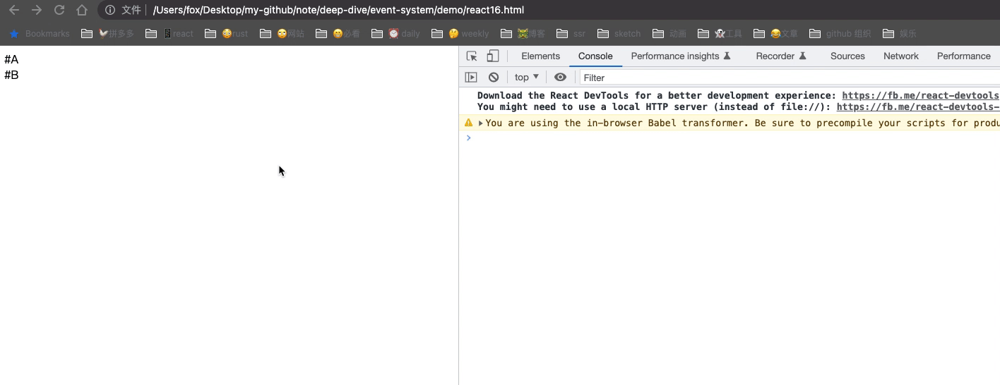
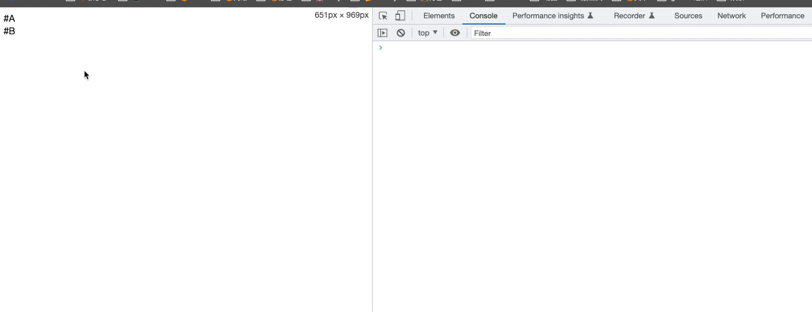

# Event System

事件系统，业务开发中只要需要与用户进行交互，那么事件是必不可少的，dom 中存在很多事件，比如 `click`，`scroll`，`focus` 等等。我们将深入事件系统中，以及事件中常用的一些操作比如 `preventDefault` 和 `stopPropagation`。同时了解事件分发，以及 `capturing` 和 `bubbling`。本文将会有大量的例子。

## capturing and bubbling

dom 是一个 tree 模型，当事件进行传播的时候会沿着 dom 的结构进行传播。

事件对象被分派到 event target，但是开始分派之前，必须首先确定事件对象的传播路径。下面这张图呈现出了 event flow。


[事件传播路径](https://www.w3.org/TR/DOM-Level-3-Events/#propagation-path)是事件通过的当前事件目标的有序列表。这个传播路径反映了文档的层次树结构。列表中的最后一项是 event target，列表中前面的项称为目标的祖先，紧接在前面的项称为目标的父项。

一旦确定了传播路径，事件对象就会经过一个或多个事件阶段。共有三个事件阶段：[capture phase](https://www.w3.org/TR/DOM-Level-3-Events/#capture-phase)，[target phase](https://www.w3.org/TR/DOM-Level-3-Events/#target-phase) 和 [bubble phase](https://www.w3.org/TR/DOM-Level-3-Events/#bubble-phase)。如果不支持某个阶段，或者事件对象的传播已停止，则该阶段将被跳过。例如，如果将 `bubble` 属性设置为 false， 则将跳过 bubble 阶段，如果在调度之前调用了 `stopPropagation`，则将跳过所有阶段。事件对象将会完成如下三个阶段：

- **capture 阶段**：事件对象通过目标的祖先从 window 传播到目标的父级。此阶段也称为捕获阶段。
- **target 阶段**：事件对象到达事件对象的事件目标。此阶段称为目标阶段。如果事件类型表明事件没有冒泡，则事件对象将在此阶段完成后停止。
- **bubble 阶段**：事件对象以相反的顺序通过目标的祖先传播，从目标的父级开始，到 window 结束。此阶段也称为冒泡阶段。

假设存在这样一个 html 片段

```html
<html>
  <body>
    <div id="A">
      <div id="B">
        <div id="C"></div>
      </div>
    </div>
  </body>
</html>
```

给 C 增加一个监听器，第三个参数为 true 代表开启了捕获。

```js
document.getElementById('C').addEventListener(
  'click',
  function (e) {
    console.log('#C was clicked')
  },
  true
)
```

当用户点击 C 的时候，捕获阶段的分发流是

`window` => `document` => `html` => `body` => ... => `目标对象的父`

target 阶段就是目标对象

冒泡阶段的事件流是

`目标对象父` => ... => `body` => `html` => `document` => `window`

使用一个具体的例子来看看总体效果，[查看例子的代码](./demo/bubbling-capturing.html)

html 片段

```html
<html>
  <body>
    <div id="A">
      <div id="B">
        <div id="C"></div>
      </div>
    </div>
  </body>
</html>
```

js 片段

```js
// 捕获阶段
document.addEventListener(
  'click',
  function (e) {
    console.log('click on document in capturing phase')
  },
  true
)
// document.documentElement == <html>
document.documentElement.addEventListener(
  'click',
  function (e) {
    console.log('click on <html> in capturing phase')
  },
  true
)
document.body.addEventListener(
  'click',
  function (e) {
    console.log('click on <body> in capturing phase')
  },
  true
)
document.getElementById('A').addEventListener(
  'click',
  function (e) {
    console.log('click on #A in capturing phase')
  },
  true
)
document.getElementById('B').addEventListener(
  'click',
  function (e) {
    e.stopPropagation()
    console.log('click on #B in capturing phase')
  },
  true
)
document.getElementById('C').addEventListener(
  'click',
  function (e) {
    console.log('click on #C in capturing phase')
  },
  true
)

// 冒泡阶段
document.addEventListener(
  'click',
  function (e) {
    console.log('click on document in bubbling phase')
  },
  false
)
// document.documentElement == <html>
document.documentElement.addEventListener(
  'click',
  function (e) {
    console.log('click on <html> in bubbling phase')
  },
  false
)
document.body.addEventListener(
  'click',
  function (e) {
    console.log('click on <body> in bubbling phase')
  },
  false
)
document.getElementById('A').addEventListener(
  'click',
  function (e) {
    console.log('click on #A in bubbling phase')
  },
  false
)
document.getElementById('B').addEventListener(
  'click',
  function (e) {
    console.log('click on #B in bubbling phase')
  },
  false
)
document.getElementById('C').addEventListener(
  'click',
  function (e) {
    console.log('click on #C in bubbling phase')
  },
  false
)
```

console 的输出取决于点击哪个元素。如果点击 C 元素，将会看到如下输出

```js
click on document in capturing phase
click on <html> in capturing phase
click on <body> in capturing phase
click on #A in capturing phase
click on #B in capturing phase
click on #C in capturing phase
click on #C in bubbling phase
click on #B in bubbling phase
click on #A in bubbling phase
click on <body> in bubbling phase
click on <html> in bubbling phase
click on document in bubbling phase
```

也可以其他元素，比如点击 A 元素，将会看到如下输出

```js
click on document in capturing phase
click on <html> in capturing phase
click on <body> in capturing phase
click on #A in capturing phase
click on #A in bubbling phase
click on <body> in bubbling phase
click on <html> in bubbling phase
click on document in bubbling phase
```

## event.stopPropagation()

当调用它时，从那时起，事件将停止传播到它本来会传播到的任何元素。这适用于两个方向(捕获和冒泡)。因此，如果您在捕获阶段的任何地方调用 `stopPropagation`，事件将永远不会到达目标阶段或冒泡阶段。如果在冒泡阶段调用它，它以及经历了捕获阶段，但它会从你调用它的点组织冒泡。

用上述相同的例子，在 B 元素的捕获阶段调用 `stopPropagation`

```js
document.getElementById('B').addEventListener(
  'click',
  function (e) {
    // 阻止事件传播
    e.stopPropagation()
    console.log('click on #B in bubbling phase')
  },
  false
)
```

此时点击 C 元素，输出如下

```js
click on document in capturing phase
click on <html> in capturing phase
click on <body> in capturing phase
click on #A in capturing phase
click on #B in capturing phase
```

可以看出到达 B 元素的捕获阶段就停止了。

如果在 A 元素的冒泡阶段调用 `stopPropagation` 会如何呢? 修改代码

```js
document.getElementById('A').addEventListener(
  'click',
  function (e) {
    e.stopPropagation()
    console.log('click on #A in bubbling phase')
  },
  false
)
```

点击 C 元素，输出如下

```js
click on document in capturing phase
click on <html> in capturing phase
click on <body> in capturing phase
click on #A in capturing phase
click on #B in capturing phase
click on #C in capturing phase
click on #C in bubbling phase
click on #B in bubbling phase
click on #A in bubbling phase
```

可以在冒泡阶段的 A 元素后就停止了冒泡。

## event.stopImmediatePropagation

`stopImmediatePropagation()` 方法阻止监听同一事件的其他事件监听器被调用。[相关例子](./demo/stopImmediatePropagation.html)

如果多个事件监听器被附加到相同元素的相同事件类型上，当此事件触发时，它们会按其被添加的顺序被调用。如果在其中一个事件监听器中执行 `stopImmediatePropagation()` ，那么剩下的事件监听器都不会被调用。

看如下例子

```html
<html>
  <body>
    <div id="A">I am the #A element</div>
  </body>
</html>
```

```js
document.getElementById('A').addEventListener(
  'click',
  function (e) {
    console.log('When #A is clicked, I shall run first!')
  },
  false
)

document.getElementById('A').addEventListener(
  'click',
  function (e) {
    console.log('When #A is clicked, I shall run second!')
    e.stopImmediatePropagation()
  },
  false
)

document.getElementById('A').addEventListener(
  'click',
  function (e) {
    console.log(
      'When #A is clicked, I would have run third, if not for stopImmediatePropagation'
    )
  },
  false
)
```

给 A 元素的点击事件增加了 3 个监听器，但是在第二个监听器出调用了 `stopImmediatePropagation`，点击 A 元素，输出如下

```js
When #A is clicked, I shall run first!
When #A is clicked, I shall run second!
```

可以看出第三次的监听器并没有执行。并且永远不会被执行，因为在第二次的内部调用了 `stopImmediatePropagation`

## event.preventDefault()

顾名思义就是阻止默认行为。这个不是很好理解，一般什么样的元素会存在默认行为呢？

比如使用 `a` 标签，a 标签上有 `href` 属性

```js
<a id="avett" href="https://www.baidu.com">
  bai du
</a>
```

正常点击 `bai du` 会跳转到百度的页面，但是如果增加 `event.preventDefault()` 会如何呢？

```js
document.getElementById('avett').addEventListener(
  'click',
  function (e) {
    e.preventDefault()
    console.log(
      'Maybe we should just play some of their music right here instead?'
    )
  },
  false
)
```

当点击 `bai du` 后，页面并没有发生跳转，而是输出了

```js
Maybe we should just play some of their music right here instead?
```

可以看出 a 标签的默认行为已经被停止了。

其他的默认行为比如 form 的 submit，通过在 button 上增加属性 `type="submit"` 可以默认触发 form 的 `submit` 函数，这种也可以通过调用 `preventDefault()` 函数来禁止掉默认行为。

## 扩展

了解了原生事件系统后，我们可以探索下 React 的事件系统，React 事件系统在 v16 和 v17 发生了一个大的变化。如下图


在 v16 相关事件挂载到 document 上，而 v17 挂载到 root 节点上。

下面我们将通过对比 v16 和 v17 来对 React 事件系统进行对比，从而也可以加深对原生事件系统的理解。

假设存在这样一个代码片段

```js
function App() {
  return (
    <div id="xxx">
      <div
        onClick={event => {
          console.log('click #A')
        }}
      >
        #A
      </div>
      <div
        onClick={event => {
          console.log('click #B')
        }}
      >
        #B
      </div>
    </div>
  )
}

const root = document.getElementById('root')

ReactDOM.render(<App />, root)

root.addEventListener('click', e => {
  e.stopPropagation()
  console.log('click root')
})
```

A 和 B 都加了点击事件，同时 root 节点增加了原生的 click 的监听器，在回调函数中调用 `stopPropagation()`。此时点击 A 或者 B

在 v16 中，A 和 B 的 click 事件都没有触发，只触发了 `root` 节点的 click 事件。



在 v17 中，A 和 B 的 click 事件都触发了，同时也触发了 `root` 节点的 click 事件。



因为在 `root` 节点的回调中，我们调用了 `stopPropagation()`，因此在 v16 版本中不会触发 A 和 B 的 click 事件，因为在 v16 中节点是挂载到 `document` 上，而在 v17 中是挂载到 `root` 节点上，所以 v17 正常，v16 存在问题。

继续修改上述的代码，后续我们只针对 v17 进行修改。

```js
const root = document.getElementById('root')

function App() {
  return (
    <div
      id="xxx"
      onClick={() => {
        console.log('xxxxx')
      }}
    >
      <div
        onClick={event => {
          event.stopPropagation()
          console.log('click #A')
        }}
      >
        #A
      </div>
      <div
        onClick={event => {
          console.log('click #B')
        }}
      >
        #B
      </div>
    </div>
  )
}

ReactDOM.render(<App />, root)

root.addEventListener('click', e => {
  console.log('click root')
})

document.getElementById('xxx').addEventListener('click', e => {
  console.log('native xxx')
})
```

在 A 事件上调用 `stopPropagation()`，同时给 `xxx` 元素上增加一个原生的事件，一个 React 的事件。此时点击 A 元素会输入什么？

```js
native xxx
click #A
click root
```

可见 `xxx` 元素上的 React 事件并没有触发，因为 React 内部会处理相关事件，使其与原生保持一致。但是我们通过调用 `addEventListener` 增加的事件，React 并没有进行处理。根据之前说的冒泡的顺序`是从当前元素一直冒泡到顶部节点`。而 A 的 React 事件是挂载到 `root` 节点上，`root` 节点是 `xxx` 节点的父，因此根据顺序应该是 `xxx => root`。所以输出的顺序是 `native xxx => click #A => click root`。

继续修改上述代码，在 `xxx` 节点增加捕获事件，同时在回调中调用 `stopPropagation()`

```js
const root = document.getElementById('root')

root.addEventListener('click', e => {
  e.stopImmediatePropagation()
  console.log('root click stopImmediatePropagation')
})
function App() {
  return (
    <div
      id="xxx"
      onClick={() => {
        console.log('xxxxx')
      }}
      onClickCapture={event => {
        event.stopPropagation()
        console.log('click xxxx capture')
      }}
    >
      <div
        onClick={event => {
          event.stopPropagation()
          console.log('click #A')
        }}
        onClickCapture={e => {
          console.log('click #B capture')
        }}
      >
        #A
      </div>
      <div
        onClick={event => {
          console.log('click #B')
        }}
      >
        #B
      </div>
    </div>
  )
}

ReactDOM.render(<App />, root)

root.addEventListener('click', e => {
  console.log('click root')
})

document.getElementById('xxx').addEventListener('click', e => {
  console.log('native xxx')
})
```

此时点击 A 看发生了什么？输出如下

```js
click xxxx capture
```

根据上述原生事件发生的顺序，如果在某个阶段阻止了事件的传播，那么后续的阶段也就会被停止。因此当我们在 `xxx` 节点增加了捕获事件后，后续的事件都不将会触发，`root` 节点的原生事件也不会被出发。因此默认增加的原生监听器是冒泡事件。

继续修改上述代码，在 `root` 节点调用 `stopImmediatePropagation()`

```js
const root = document.getElementById('root')

root.addEventListener('click', e => {
  e.stopImmediatePropagation()
  console.log('root click stopImmediatePropagation')
})

function App() {
  return (
    <div
      id="xxx"
      onClick={() => {
        console.log('xxxxx')
      }}
    >
      <div
        onClick={event => {
          console.log('click #A')
        }}
      >
        #A
      </div>
      <div
        onClick={event => {
          console.log('click #B')
        }}
      >
        #B
      </div>
    </div>
  )
}

ReactDOM.render(<App />, root)

root.addEventListener('click', e => {
  console.log('click root')
})

document.getElementById('xxx').addEventListener('click', e => {
  console.log('native xxx')
})
```

点击 A 原生，会发生什么？输出如下

```js
native xxx
root click stopImmediatePropagation
```

根据上文说的 `stopImmediatePropagation()` 会组织后续监听事件的执行。因此现在 A 事件 和 B 事件以及 root 事件都不会触发了。那么为什么会输出 `native xxx` 呢？因为这个是原生添加到 `xxx` 元素的监听器，并不受 `root` 的影响。

目前 React 并没有暴露出 `stopImmediatePropagation` 事件，因为我们没办法在一个元素上写两个 `click`。因此问题不大。

可以看出 React 现在事件基本和原生事件流保持一致了，但是如果要结合原生事件一起使用的话，只要弄清楚事件流即可。
