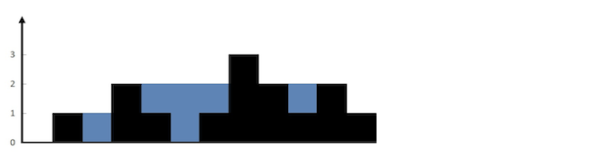

# 直方图的水量

给定一个直方图(也称柱状图)，假设有人从上面源源不断地倒水，最后直方图能存多少水量?直方图的宽度为 1。



上面是由数组 `[0,1,0,2,1,0,1,3,2,1,2,1]` 表示的直方图，在这种情况下，可以接 6 个单位的水（蓝色部分表示水）。  感谢 Marcos 贡献此图。

```ts
输入: [0, 1, 0, 2, 1, 0, 1, 3, 2, 1, 2, 1]
输出: 6
```

## 题解

接雨水从题目可以看出接雨水的多少取决于最小的那块，和木桶原理类似。所以可以采用动态规划的做法进行遍历，分别求出 `leftMax` 和 `rightMax`, 然后根据 `Math.min(leftMax[i], rightMax[i]) - height[i]` 获取的雨水量。一般通过左右遍历的方法可以换用双指针的形式来做。把两次循环换成两个指针，`leftPoint` 和 `rightPoint` 。维护两个变量来存储 `leftMax` 和 `rightMax`。
