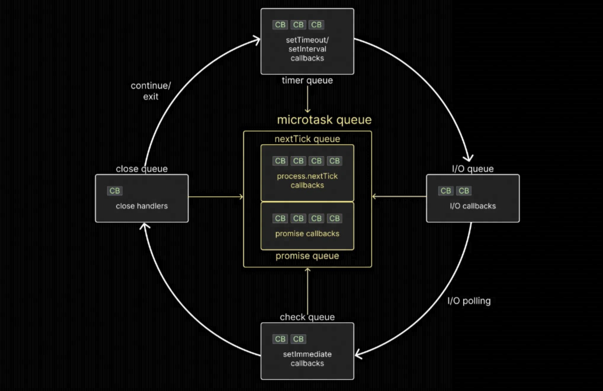

# event loop

从技术上讲，事件循环只是一个 C 程序。但是，您可以将其视为一种设计模式，用于编排或协调 Node.js 中同步和异步代码的执行。

事件循环是一个循环，只要您的 Node.js 应用程序启动并运行就会运行。每个循环中有六个不同的队列，每个队列保存一个或多个最终需要在调用堆栈上执行的回调函数。



- 首先，有计时器队列（技术上是最小堆），它保存与 setTimeout 和 setInterval 关联的回调。
- 其次，I/O 队列包含与所有异步方法关联的回调，例如与 和 fs 模块关联的方法 http。
- 第三，检查队列与 setImmediate 函数关联的回调，这是 Node 特有的。
- 第四，关闭队列保存与异步任务的关闭事件关联的回调。

最后，还有包含两个独立队列的微任务队列。

- nextTick 队列，其中包含与 process.nextTick 函数关联的回调。
- Promise 队列，其中包含与 JavaScript 中的本机 Promise 关联的回调。

## 事件循环是如何工作的

在事件循环中，执行顺序遵循一定的规则。有很多规则可以绕过你的头脑，所以让我们一次过一遍(这个规则很重要)：

1. 执行微任务队列中的任何回调。首先，nextTick 队列中的任务，然后才是 promise 队列中的任务。
2. 执行计时器队列中的所有回调。
3. 微任务队列中的回调（如果存在）在定时器队列中的每个回调之后执行。首先是 nextTick 队列中的任务，然后是 promise 队列中的任务。
4. 执行 I/O 队列中的所有回调。
5. 执行微任务队列（如果存在）中的回调，从 nextTick 队列开始，然后是 Promise 队列。
6. 执行检查队列(check)中的所有回调。
7. 微任务队列中的回调（如果存在）在检查队列中的每个回调之后执行。首先是 nextTick 队列中的任务，然后是 promise 队列中的任务。
8. 执行关闭队列中的所有回调。
9. 在同一个循环中的最后一次，微任务队列被执行。首先是 nextTick 队列中的任务，然后是 promise 队列中的任务。

记住上面的那张图基本就能完全理解 event loop。接下来每一个点都使用一个例子来具体讲解

### nextTick 和 Promise 队列

```js
process.nextTick(() => console.log('this is process.nextTick 1'))
process.nextTick(() => {
  console.log('this is process.nextTick 2')
  process.nextTick(() =>
    console.log('this is the inner next tick inside next tick')
  )
})
process.nextTick(() => console.log('this is process.nextTick 3'))

Promise.resolve().then(() => console.log('this is Promise.resolve 1'))
Promise.resolve().then(() => {
  console.log('this is Promise.resolve 2')
  process.nextTick(() =>
    console.log('this is the inner next tick inside Promise then block')
  )
})
Promise.resolve().then(() => console.log('this is Promise.resolve 3'))
```

运行上述代码看下返回结果

```js
this is process.nextTick 1
this is process.nextTick 2
this is process.nextTick 3
this is the inner next tick inside next tick
this is Promise.resolve 1
this is Promise.resolve 2
this is Promise.resolve 3
this is the inner next tick inside Promise then block
```

从结果可以看出，`执行微任务队列中的任何回调。首先，nextTick 队列中的任务，然后才是 promise 队列中的任务。` 这里需要注意下 `promise2`，在 `promise2` 内部调用了 `process.nextTick`，因为此时的队列仍然是 promise 队列中，所有 promise2 出列后，promise3 再出列。，此时 promise 的队列为空。Node 将再次检查微任务队列中是否有回调，由于队列中有一个 nextTick，它会执行它，这会产生我们的最后一条日志语句。

### 计时器回调

```js
// index.js
setTimeout(() => console.log('this is setTimeout 1'), 0)
setTimeout(() => console.log('this is setTimeout 2'), 0)
setTimeout(() => console.log('this is setTimeout 3'), 0)

process.nextTick(() => console.log('this is process.nextTick 1'))
process.nextTick(() => {
  console.log('this is process.nextTick 2')
  process.nextTick(() =>
    console.log('this is the inner next tick inside next tick')
  )
})
process.nextTick(() => console.log('this is process.nextTick 3'))

Promise.resolve().then(() => console.log('this is Promise.resolve 1'))
Promise.resolve().then(() => {
  console.log('this is Promise.resolve 2')
  process.nextTick(() =>
    console.log('this is the inner next tick inside Promise then block')
  )
})
Promise.resolve().then(() => console.log('this is Promise.resolve 3'))
```

结果如下：

```js
this is process.nextTick 1
this is process.nextTick 2
this is process.nextTick 3
this is the inner next tick inside next tick
this is Promise.resolve 1
this is Promise.resolve 2
this is Promise.resolve 3
this is the inner next tick inside Promise then block
this is setTimeout 1
this is setTimeout 2
this is setTimeout 3
```

从结果出可以得出结论 2

> 执行计时器队列中的所有回调。

再来看一个例子

```js
// index.js
setTimeout(() => console.log('this is setTimeout 1'), 0)
setTimeout(() => {
  console.log('this is setTimeout 2')
  process.nextTick(() =>
    console.log('this is inner nextTick inside setTimeout')
  )
  Promise.resolve().then(() =>
    console.log('this is inner promise inside setTimeout')
  )
}, 0)
setTimeout(() => console.log('this is setTimeout 3'), 0)

process.nextTick(() => console.log('this is process.nextTick 1'))
process.nextTick(() => {
  console.log('this is process.nextTick 2')
  process.nextTick(() =>
    console.log('this is the inner next tick inside next tick')
  )
})
process.nextTick(() => console.log('this is process.nextTick 3'))

Promise.resolve().then(() => console.log('this is Promise.resolve 1'))
Promise.resolve().then(() => {
  console.log('this is Promise.resolve 2')
  process.nextTick(() =>
    console.log('this is the inner next tick inside Promise then block')
  )
})
Promise.resolve().then(() => console.log('this is Promise.resolve 3'))
```

输出如下：

```js
this is process.nextTick 1
this is process.nextTick 2
this is process.nextTick 3
this is the inner next tick inside next tick
this is Promise.resolve 1
this is Promise.resolve 2
this is Promise.resolve 3
this is the inner next tick inside Promise then block
this is setTimeout 1
this is setTimeout 2
this is inner nextTick inside setTimeout
this is inner promise inside setTimeout
this is setTimeout 3
```

在 `setTimeout2` 中增加了一个 `process.nextTick` 和 `promise`。可以看运行的顺序，先运行了 `setTimeout2` 内部的 `process.nextTick` 然后是内部的 `promise` 最后才是 `setTimeout3`。

> 可以得出**微任务队列中的回调在定时器队列中的回调执行之间执行**，并且**微任务队列中的回调（如果存在）在定时器队列中的每个回调之后执行。首先是 nextTick 队列中的任务，然后是 promise 队列中的任务**

### IO 回调

先看一个简单的例子

```js
// index.js
const fs = require('fs')

fs.readFile(__filename, () => {
  console.log('this is readFile 1')
})

process.nextTick(() => console.log('this is process.nextTick 1'))
Promise.resolve().then(() => console.log('this is Promise.resolve 1'))
```

输出如下：

```js
this is process.nextTick 1
this is Promise.resolve 1
this is readFile 1
```

先执行微任务中的回调，在执行 IO 的回调。可以推论出

> 微任务队列中的回调在 I/O 队列中的回调之前执行。

再看一个例子，这个例子比较特殊

```js
// index.js
const fs = require('fs')

setTimeout(() => console.log('this is setTimeout 1'), 0)

fs.readFile(__filename, () => {
  console.log('this is readFile 1')
})
```

执行 5 次看下输出

```js
➜  event-loop node test.js
this is setTimeout 1
this is readFile 1
➜  event-loop node test.js
this is setTimeout 1
this is readFile 1
➜  event-loop node test.js
this is readFile 1
this is setTimeout 1
➜  event-loop node test.js
this is setTimeout 1
this is readFile 1
➜  event-loop node test.js
this is setTimeout 1
this is readFile 1
➜  event-loop
```

可以看出顺序是不定的。`setTimeout()` 这种输出不一致的发生是由于使用延迟 0 毫秒和 I/O 异步方法时执行顺序的不可预测性。出现的明显问题是，“为什么不能保证执行顺序？”

异常是由于如何为计时器设置最小延迟。在 [DOMTimer 的 C++ 代码](https://chromium.googlesource.com/chromium/blink/+/master/Source/core/frame/DOMTimer.cpp#93)中，我们遇到了一段非常有趣的代码。以毫秒为单位计算间隔，但计算上限为 1 毫秒或用户传递的间隔乘以 1 毫秒。

这意味着如果我们传入 0 毫秒，则间隔设置为 max(1,0)，即 1。这将导致 setTimeout 延迟 1 毫秒。似乎 Node.js 遵循类似的实现。当您设置 0 毫秒延迟时，它会被覆盖为 1 毫秒延迟。

但是 1ms 的延迟如何影响两个日志语句的顺序？

在事件循环开始时，Node.js 需要确定 1ms 计时器是否已经过去。如果事件循环在 0.05 毫秒时进入定时器队列并且 1 毫秒回调尚未排队，控制将移至 I/O 队列，执行回调 `readFile()`。在事件循环的下一次迭代中，定时器队列回调将被执行。

另一方面，如果 CPU 很忙并在 1.01 ms 时进入定时器队列，则定时器将超时并执行回调函数。然后控制将进入 I/O 队列，回调 `readFile()` 将被执行。

由于 CPU 有多忙以及 0ms 延迟被覆盖为 1ms 延迟的不确定性，我们永远无法保证 0ms 计时器和 I/O 回调之间的执行顺序。

因此

> 当 `setTimeout()` 以 0ms 延迟和 I/O 异步方法运行时，执行顺序永远无法保证。

继续看例子

```js
const fs = require('fs')

fs.readFile(__filename, () => {
  console.log('this is readFile 1')
})

process.nextTick(() => console.log('this is process.nextTick 1'))
Promise.resolve().then(() => console.log('this is Promise.resolve 1'))
setTimeout(() => console.log('this is setTimeout 1'), 0)

for (let i = 0; i < 2000000000; i++) {}
```

为了避免之前实验中的任何计时器问题，我们添加了一个不执行任何操作的 for 循环。这确保当控件进入定时器队列时，定时器 setTimeout()已经过去，回调已准备好执行。

结果如下：

```js
this is process.nextTick 1
this is Promise.resolve 1
this is setTimeout 1
this is readFile 1
```

因此，结论`4. 执行 I/O 队列中的所有回调。`验证成功。

继续下一个例子，这个例子可以仔细看看

```js
// index.js
const fs = require('fs')

fs.readFile(__filename, () => {
  console.log('this is readFile 1')
})

process.nextTick(() => console.log('this is process.nextTick 1'))
Promise.resolve().then(() => console.log('this is Promise.resolve 1'))
setTimeout(() => console.log('this is setTimeout 1'), 0)
setImmediate(() => console.log('this is setImmediate 1'))

for (let i = 0; i < 2000000000; i++) {}
```

结果如下

```js
this is process.nextTick 1
this is Promise.resolve 1
this is setTimeout 1
this is setImmediate 1
this is readFile 1
```

这可能看起来很奇怪，因为 I/O 队列出现在检查队列之前，但是一旦我们理解了发生在两个队列之间的 I/O 轮询的概念，它就有意义了。

首先，所有函数都在调用堆栈上执行，导致回调在适当的队列中排队。但是，`readFile()` 回调并没有同时排队。让我解释一下为什么。

当控件进入事件循环时，首先检查微任务队列中的回调。在这种情况下，nextTick 队列和 promise 队列中各有一个回调。nextTick 队列具有优先权，因此我们看到首先记录“nextTick 1”，然后是“Promise 1”。

两个队列都是空的，控制移至定时器队列。有一个回调，将“setTimeout 1”记录到控制台。

现在到了有趣的部分。当控件到达 I/O 队列时，我们希望 `readFile()` 回调出现，对吗？毕竟，我们有一个长时间运行的 for 循环，readFile()现在应该已经完成了。

然而，实际上，事件循环必须轮询以检查 I/O 操作是否完成，并且它只对完成的操作回调进行排队。这意味着当控件第一次进入 I/O 队列时，队列仍然是空的。

然后控制进入事件循环的轮询部分，检查 `readFile()` 任务是否已经完成。`readFile()` 确认它有，事件循环现在将关联的回调函数添加到 I/O 队列。然而，执行已经移过 I/O 队列，回调必须等待轮到它执行。

控件然后继续检查队列，在那里找到一个回调。它将“setImmediate 1”记录到控制台，然后开始新的迭代，因为在事件循环的当前迭代中没有其他要处理的内容。

看起来 microtask 和 timer 队列是空的，但是 I/O 队列中有一个回调。回调被执行，“readFile 1”最终被记录到控制台。

这就是为什么我们看到“setImmediate 1”记录在“readFile 1”之前。这种行为实际上也发生在我们之前的实验中，但是我们没有任何进一步的代码可以运行，所以我们没有观察到它。

可以得出结论

> 一旦 I/O 操作完成，其回调函数不会立即排队到 I/O 队列中。相反，I/O 轮询阶段会检查 I/O 操作的完成情况，并对已完成操作的回调进行排队。这有时会导致在 I/O 队列回调之前执行检查队列回调。
> 但是，当两个队列都包含回调函数时，I/O 队列中的回调总是优先并首先运行。在设计依赖 I/O 回调的系统以确保回调的正确排序和执行时，了解此行为至关重要。

### check 队列

第 5 点的结论到现在还没有被验证，我们就下一个例子来验证

```js
// index.js
const fs = require('fs')

fs.readFile(__filename, () => {
  console.log('this is readFile 1')
  setImmediate(() => console.log('this is setImmediate 1'))
  process.nextTick(() =>
    console.log('this is inner process.nextTick inside readFile')
  )
  Promise.resolve().then(() =>
    console.log('this is inner Promise.resolve inside readFile')
  )
})

process.nextTick(() => console.log('this is process.nextTick 1'))
Promise.resolve().then(() => console.log('this is Promise.resolve 1'))
setTimeout(() => console.log('this is setTimeout 1'), 0)

for (let i = 0; i < 2000000000; i++) {}
```

结果如下：

```js
this is process.nextTick 1
this is Promise.resolve 1
this is setTimeout 1
this is readFile 1
this is inner process.nextTick inside readFile
this is inner Promise.resolve inside readFile
this is setImmediate 1
```

在 `readFile()` 中调用了 `setImmediate` 和 `process.nextTick` 以及 `promise`，可以看出先执行了微任务，然后才到检查队列中。

因此可以得出

> 微任务队列回调在 I/O 队列回调之后和检查队列回调之前执行。这也是第 5 点 执行微任务队列（如果存在）中的回调，从 nextTick 队列开始，然后是 Promise 队列。的结论

同时从上面的例子中也可以看出顺序显示执行微任务，然后到 timer 队列，再到 IO 队列，最后到 check 队列。

因此第 6 点结论也被证明

> Check 队列回调在微任务队列回调、定时器队列回调和 I/O 队列回调执行后执行。

为了证明第 8 点的结论，我们继续下面的例子

```js
//index.js
setImmediate(() => console.log('this is setImmediate 1'))
setImmediate(() => {
  console.log('this is setImmediate 2')
  process.nextTick(() => console.log('this is process.nextTick 1'))
  Promise.resolve().then(() => console.log('this is Promise.resolve 1'))
})
setImmediate(() => console.log('this is setImmediate 3'))
```

结果如下：

```js
this is setImmediate 1
this is setImmediate 2
this is process.nextTick 1
this is Promise.resolve 1
this is setImmediate 3
```

可以看出在 `setImmediate2` 里先执行了微任务，然后才执行到 `setImmediate3`

可以得出：

> 微任务队列回调在检查队列回调之间执行。同时也是第 `7.微任务队列中的回调（如果存在）在检查队列中的每个回调之后执行。首先是 nextTick 队列中的任务，然后是 promise 队列中的任务`。的结论

再看一个和 IO 队列中一个近似的例子

```js
// index.js
setTimeout(() => console.log('this is setTimeout 1'), 0)
setImmediate(() => console.log('this is setImmediate 1'))
```

运行 5 次代码，看下输出

```js
➜  event-loop node test.js
this is setImmediate 1
this is setTimeout 1
➜  event-loop node test.js
this is setImmediate 1
this is setTimeout 1
➜  event-loop node test.js
this is setImmediate 1
this is setTimeout 1
➜  event-loop node test.js
this is setTimeout 1
this is setImmediate 1
➜  event-loop node test.js
this is setImmediate 1
this is setTimeout 1
```

由于 CPU 使用率的不确定性，我们永远无法保证 0ms 定时器和检查队列回调之间的执行顺序。

因此可以推论出：

> `setTimeout()` 延迟 0ms 和 `setImmediate()` 方法运行时，执行顺序永远无法保证。

### close 队列

```js
// index.js
const fs = require('fs')

const readableStream = fs.createReadStream(__filename)
readableStream.close()

readableStream.on('close', () => {
  console.log('this is from readableStream close event callback')
})
setImmediate(() => console.log('this is setImmediate 1'))
setTimeout(() => console.log('this is setTimeout 1'), 0)
Promise.resolve().then(() => console.log('this is Promise.resolve 1'))
process.nextTick(() => console.log('this is process.nextTick 1'))
```

结果如下：

```js
this is process.nextTick 1
this is Promise.resolve 1
this is setTimeout 1
this is setImmediate 1
this is from readableStream close event callback
```

可以得出结论：

> 关闭队列回调在事件循环的给定迭代中的所有其他队列回调之后执行。

## 结论

事件循环是一个 C 程序，用于协调 Node.js 中同步和异步代码的执行。它管理六个不同的队列：nextTick、promise、timer、I/O、check 和 close。

要将任务添加到 nextTick 队列，我们使用方法 `process.nextTick()`。要将任务添加到 promise 队列，我们 resolve 或 reject promise。要将任务添加到计时器队列，我们使用 `setTimeout()` or `setInterval()`。

要将任务添加到 I/O 队列，我们执行一个异步方法。要将任务添加到检查队列，我们使用 `setImmediate()` 函数。最后，为了将任务添加到 close 队列中，我们附加了关闭事件侦听器。

执行顺序与此处列出的顺序相同。但是，需要注意的是，nextTick 和 promise 队列是在每个队列之间以及计时器和检查队列中的每个回调执行之间执行的。

## 引用

- [visual-guide-to-nodejs-event-loop](https://www.builder.io/blog/visual-guide-to-nodejs-event-loop)
