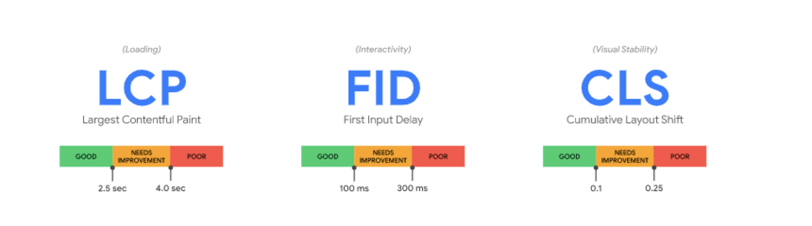
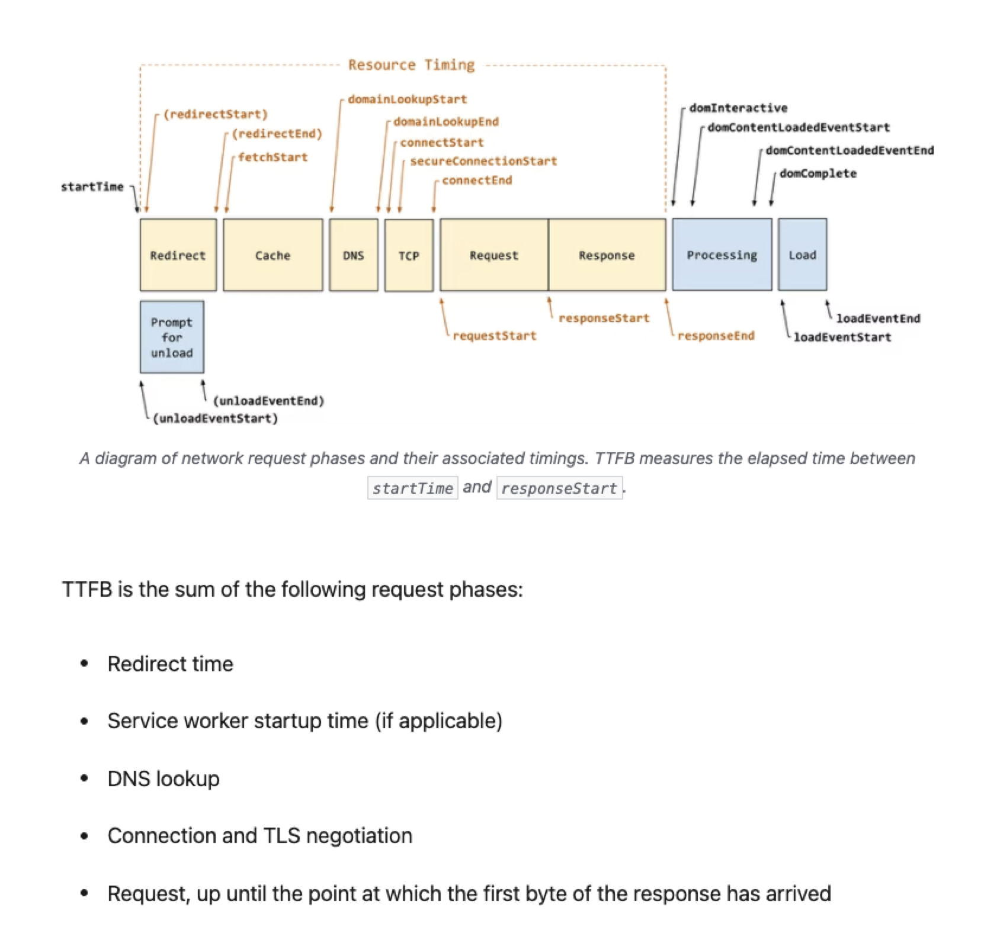

# 性能

最近一段时间一直在做性能优化，因为老板觉得 C 端的[百亿补贴](https://mobile.yangkeduo.com/brand_activity_subsidy.html?_pdd_fs=1&_pdd_tc=ffffff&_pdd_sbs=1&access_from=home&refer_page_el_sn=1110237&refer_page_name=index&refer_page_id=10002_1645756588351_87u6ynbyh4&refer_page_sn=10002)的性能优化速度很快，因此希望我们的速度能超过百亿补贴。

## 重要指标

在 [web 指标文档](https://web.dev/vitals/)中可以看到 web 性能的[指标](https://web.dev/user-centric-performance-metrics/#how-metrics-are-measured)主要有三个。具体模型可以参考[使用 RAIL 模型衡量性能](https://web.dev/rail/#chrome-devtools)。



如果对指标再一步进行细分，还可以有 [TTFB](https://web.dev/ttfb/)



FP，[FCP](https://web.dev/i18n/zh/fcp/)，[TTI](https://web.dev/tti/), [TBT](https://web.dev/tbt/) 等(其中的各个指标的优化策略在对应的文档中都能找到)。当然最重要的还是核心指标(以用户为中心)。

- [Largest Contentful Paint (LCP)](https://web.dev/lcp/) ：最大内容绘制，测量加载性能。为了提供良好的用户体验，LCP 应在页面首次开始加载后的 2.5 秒内发生。

  - 如何优化 LCP，可以参考 [优化 Largest Contentful Paint 最大内容绘制](https://web.dev/optimize-lcp/)
    - [缓慢的服务器响应速度](https://web.dev/optimize-lcp/#slow-servers)
    - [阻塞渲染的 JavaScript 和 CSS](https://web.dev/optimize-lcp/#render-blocking-resources)
    - [缓慢的资源加载速度](https://web.dev/optimize-lcp/#slow-resource-load-times)
    - [客户端渲染](https://web.dev/optimize-lcp/#client-side-rendering)

- [First Input Delay (FID)](https://web.dev/fid/) ：首次输入延迟，测量交互性。为了提供良好的用户体验，页面的 FID 应为 100 毫秒或更短。

  如何优化 FID，可以参考 [优化 First Input Delay 首次输入延迟](https://web.dev/optimize-fid/)

- [Cumulative Layout Shift (CLS)](https://web.dev/cls/) ：累积布局偏移，测量视觉稳定性。为了提供良好的用户体验，页面的 CLS 应保持在 0.1. 或更少。

  如何优化 CLS，可以参考 [优化 Cumulative Layout Shift 累积布局偏移](https://web.dev/optimize-cls/)

## 通用优化

除了上述针对 LCP，FID，CLS 的优化，也有其他通用的优化。

### DNS 预获取

[dns-prefetch DNS 预获取](https://developer.mozilla.org/zh-CN/docs/Web/Performance/dns-prefetch) 是尝试在请求资源之前解析域名。这可能是后面要加载的文件，也可能是用户尝试打开的链接目标。

#### 预发

```ts
<link rel="dns-prefetch" href="https://fonts.googleapis.com/">
```

#### 例子

```tsx
<html>
  <head>
    <link rel="dns-prefetch" href="https://fonts.gstatic.com/">
    <!-- and all other head elements -->
  </head>
  <body>
    <!-- your page content -->
  </body>
</html>
```

#### 注意事项

1. 首先，dns-prefetch 仅对跨域域上的 DNS 查找有效，因此请避免使用它来指向您的站点或域。这是因为，到浏览器看到提示时，您站点域背后的 IP 已经被解析。
2. 还可以通过使用 HTTP 链接字段将 dns-prefetch（以及其他资源提示）指定为 HTTP 标头：

```ts
Link: <https://fonts.gstatic.com/>; rel=dns-prefetch
```

3. 考虑将 dns-prefetch 与 preconnect(预连接)提示配对。尽管 dns-prefetch 仅执行 DNS 查找，但 preconnect 会建立与服务器的连接。如果站点是通过 HTTPS 服务的，则此过程包括 DNS 解析，建立 TCP 连接以及执行 TLS 握手。将两者结合起来可提供进一步减少跨域请求的感知延迟的机会。您可以安全地将它们一起使用，如下所示：

```ts
<link rel="preconnect" href="https://fonts.gstatic.com/" crossorigin>
<link rel="dns-prefetch" href="https://fonts.gstatic.com/">
```

> Note: 如果页面需要建立与许多第三方域的连接，则将它们预先连接会适得其反。 preconnect 提示最好仅用于最关键的连接。对于其他的，只需使用 <link rel="dns-prefetch"> 即可节省第一步的时间-DNS 查找。

### 懒加载

**延迟加载(懒加载)**是一种将资源标识为非阻塞（非关键）资源并仅在需要时加载它们的策略。 这是一种缩短关键渲染路径长度的方法，可以**缩短页面加载时间**。

#### 策略

1. 代码拆分，js，css，html 都能被拆成小的 chunks。
   - Entry point splitting: separates code by entry point(s) in the app
   - Dynamic splitting: separates code where dynamic import() statements are used
2. 任何类型为 **type="module"** 的脚本标签都被视为一个 JavaScript 模块，并且默认情况下会被延迟。
3. 默认情况下，CSS 被视为渲染阻塞资源，因此，在 CSSOM 被构造完成之前，浏览器不会渲染任何已处理的内容。CSS 必须很薄，才能尽快交付，建议使用媒体类型和查询实现非阻塞渲染。

```ts
<link href="style.css"    rel="stylesheet" media="all">
<link href="portrait.css" rel="stylesheet" media="orientation:portrait">
<link href="print.css"    rel="stylesheet" media="print">
```

4. 默认情况下，字体请求会延迟到构造渲染树之前，这可能会导致文本渲染延迟。可以使用 `<link rel="preload">`
5. 图片和 iframe 懒加载。

```ts

<iframe src="video-player.html" title="..." loading="lazy"></iframe>
```

---

其他的相关性能优化也可以从 mdn 的 [web 性能](https://developer.mozilla.org/zh-CN/docs/Web/Performance)中找出相关方案。

---

## 其他文章引用

### 重要部分

- _[Largest Contentful Paint (LCP)](https://web.dev/lcp/)_
- _[优化 Largest Contentful Paint 最大内容绘制](https://web.dev/optimize-lcp/)_
- _[First Input Delay (FID)](https://web.dev/fid/)_
- _[优化 First Input Delay 首次输入延迟](https://web.dev/optimize-fid/)_
- _[Cumulative Layout Shift (CLS)](https://web.dev/cls/)_
- _[优化 Cumulative Layout Shift 累积布局偏移](https://web.dev/optimize-cls/)_
- _[渲染页面：浏览器的工作原理](https://developer.mozilla.org/zh-CN/docs/Web/Performance/How_browsers_work)_

### 其他

- _[感知性能](https://developer.mozilla.org/zh-CN/docs/Learn/Performance/perceived_performance)_
