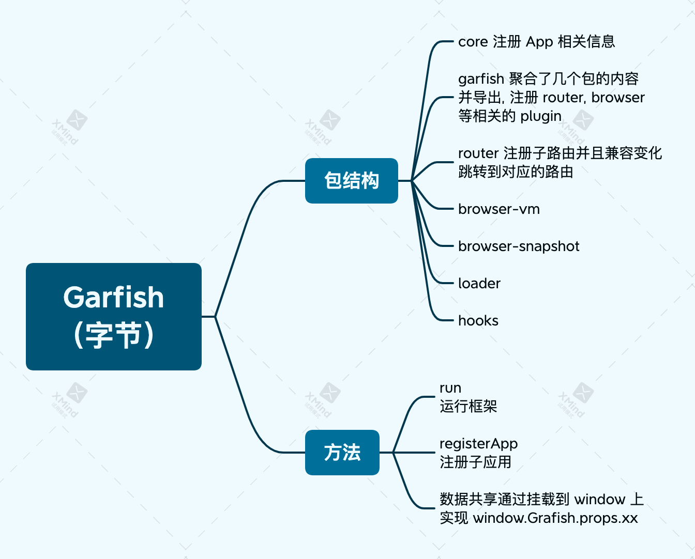

# 微前端

- [如何设计微前端中的主子路由调度](https://mp.weixin.qq.com/s?__biz=Mzg4MjE5OTI4Mw==&mid=2247484940&idx=1&sn=178bd6502a3fad861fd4541fa33c242d&scene=21#wechat_redirect)

微前端的路由处理，通过一个控制层来接受路由，并且对不同的路由进行预处理在分发到各个子系统中。

## Garfish

字节的微前端框架 [Garfish](https://github.com/bytedance/garfish)

## micro-app

京东的微前端框架 [micro-app](https://github.com/micro-zoe/micro-app)， 采用的思路比较特殊，使用的类似 React 的形式，通过提供 webcomponent 的组件
进行快速的接入。

