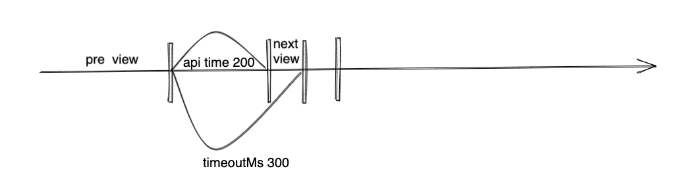
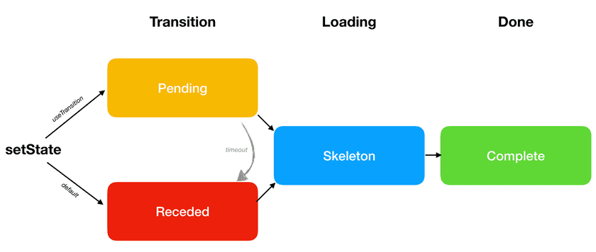

# React Concurrent

React concurrent 模式的一些总结。

## useTransition

根据官网解释，useTransition 是为了保持前一个页面展示的内容，在到达了规定的时间后再展示新的内容。

如果不使用 useTransition, 在接口返回后会立即替换掉之前的内容。


使用了 useTransition 就有了一个时间的延迟

```jsx
const [startTransition, isPending] = useTransition({ timeoutMs: 3000 })
```

`timeoutMs` 为配置的时间，返回一个数据，第一个参数用于设置某些状态需要被延迟显示的，第二个参数表示是否在 pending。

比如

```jsx
return (
  <>
    <button
      disabled={isPending}
      onClick={() => {
        startTransition(() => {
          const nextUserId = getNextId(resource.userId)
          setResource(fetchProfileData(nextUserId))
        })
      }}
    >
      Next
    </button>
    {isPending ? ' Loading...' : null}
    <ProfilePage resource={resource} />
  </>
)
```

[Try it on CodeSandbox](https://codesandbox.io/s/jovial-lalande-26yep)

接口响应的时间可能超过设置的 `timeoutMs` 也有可能少于 `timeoutMs`。

如果接口响应时间少于 `timeoutMs`



接口响应后就会立即展示响应后的内容。

如果接口响应时间大于 `timeoutMs`


在 `timeoutMs` 之前一直显示之前的 view, 当超过了这个时间后如果有 Spin 则显示响应的 Spin, 等待接口响应后再显示新的 view。

### The Three Steps



具体可以参考[官网](https://reactjs.org/docs/concurrent-mode-patterns.html)

## useDeferredValue

TODO
