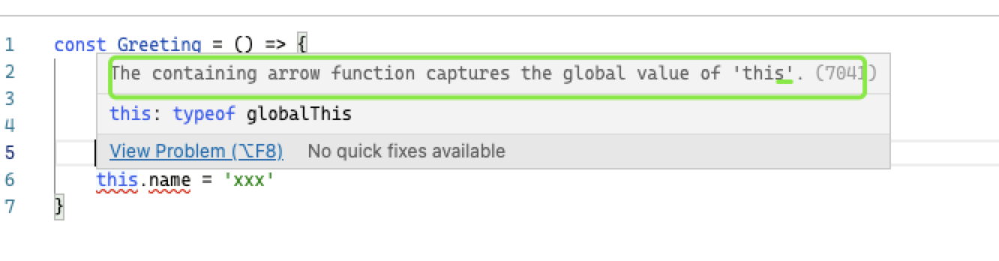

# 对 Dan 的博客以及一些 twitter 看完的分析以及侧重点

希望其他人在阅读的时候能够直接提取中心点, 了解 Dan 对 React 的深层次理解。

- [How Does React Tell a Class from a Function?](https://overreacted.io/zh-hans/how-does-react-tell-a-class-from-a-function/)

React 如何区分 Class 和 Function？部分原话来自 Dan 的博客

---

目前定义 React 组件有两种方式，以函数形式定义的 `Greeting` 组件

```tsx
function Greeting() {
  return <p>Hello</p>
}
```

React 也支持将他定义成一个类：

```tsx
class Greeting extends React.Component {
  render() {
    return <p>Hello</p>
  }
}
```

当你要渲染一个 `<Greeting />` 组件时，你并不需要关心它是如何定义的：

```tsx
// 是类还是函数 —— 无所谓
<Greeting />
```

_但 React 本身 在意其中的差别！_

如果 `Greeting` 是一个函数，React 需要调用它。

```tsx
// 你的代码
function Greeting() {
  return <p>Hello</p>
}

// React 内部
const result = Greeting(props) // <p>Hello</p>
```

但如果 `Greeting` 是一个类，React 需要先用 new 操作符将其实例化，然后 调用刚才生成实例的 render 方法

```tsx
// 你的代码
class Greeting extends React.Component {
  render() {
    return <p>Hello</p>
  }
}

// React 内部
const instance = new Greeting(props) // Greeting {}
const result = instance.render() // <p>Hello</p>
```

**所以 React 是怎么知道某样东西是 class 还是 function 的呢？**

---

首先，我们需要理解为什么把函数和类分开处理很重要。注意看我们是怎么使用 new 操作符来调用一个类的：

```tsx
// 如果 Greeting 是一个函数
const result = Greeting(props) // <p>Hello</p>

// 如果 Greeting 是一个类
const instance = new Greeting(props) // Greeting {}
const result = instance.render() // <p>Hello</p>
```

`new` 在 JavaScript 中已经存在了好久了，然而类还只是最近的事，它的出现让我们能够重构我们前面的代码以使它更符合我们的本意：

```tsx
class Person {
  constructor(name) {
    this.name = name
  }
  sayHi() {
    alert('Hi, I am ' + this.name)
  }
}

let fred = new Person('Fred')
fred.sayHi()
```

*捕捉开发者的本意*是语言和 API 设计中非常重要的一点。

加不加 `new` 的差别

|            | `new Person()`                 | `Person()`                           |
| ---------- | ------------------------------ | ------------------------------------ |
| `class`    | ✅ `this` 是一个 `Person` 实例 | 🔴 `TypeError`                       |
| `function` | ✅ `this` 是一个 `Person` 实例 | 😳 `this` 是 `window` 或 `undefined` |

这就是 React 正确调用你的组件很重要的原因。如果你的组件被定义为一个类，React 需要使用 **new** 来调用它。

好，那 React 可以直接在每次调用时都加上 `new` 吗？很遗憾，这种方法并不总是有用。

对于常规函数，用 `new` 调用会给它们一个 `this` 作为对象实例。对于用作构造函数的函数（比如我们前面提到的 Person）是可取的，但对函数组件这或许就比较令人困惑了：

```tsx
function Greeting() {
  // 我们并不期望 `this` 在这里表示任何类型的实例
  return <p>Hello</p>
}
```

关于为什么总是使用 `new` 是没用的的第一个理由是，对于原生的箭头函数（不是那些被 Babel 编译过的），用 `new` 调用会抛出一个错误：

```tsx
const Greeting = () => <p>Hello</p>
new Greeting() // 🔴 Greeting 不是一个构造函数
```


这个行为是遵循箭头函数的设计而刻意为之的。箭头函数的一个附带作用是它没有自己的 `this` 值 —— `this` 解析自离得最近的常规函数：

```tsx
class Friends extends React.Component {
  render() {
    const friends = this.props.friends
    return friends.map(friend => (
      <Friend
        // `this` 解析自 `render` 方法
        size={this.props.size}
        name={friend.name}
        key={friend.id}
      />
    ))
  }
}
```

OK，所以箭头函数没有自己的 `this`。但这意味着它作为构造函数是完全无用的！

```tsx
const Person = name => {
  // 🔴 这么写是没有意义的！
  this.name = name
}
```



React 不能简单对所有东西都使用 `new`，因为会破坏箭头函数！我们可以利用箭头函数没有 `prototype` 的特点来检测箭头函数，不对它们使用 `new`：

```
(() => {}).prototype // undefined
(function() {}).prototype // {constructor: f}
```


但这对于被 Babel 编译过的函数是[没用](https://github.com/facebook/react/issues/4599#issuecomment-136562930)的。这或许没什么大不了，但还有另一个原因使得这条路不会有结果。

---

另一个我们不能总是使用 new 的原因是它会妨碍 React 支持返回字符串或其它原始类型的组件。

```tsx
function Greeting() {
  return 'Hello'
}

Greeting() // ✅ 'Hello'
new Greeting() // 😳 Greeting {}
```

这，再一次，和 [`new` 操作符](https://developer.mozilla.org/en-US/docs/Web/JavaScript/Reference/Operators/new)的怪异设计有关。如我们之前所看到的，new 告诉 JavaScript 引擎去创建一个对象，让这个对象成为函数内部的 this，然后把这个对象作为 new 的结果给我们。

然而，JavaScript 也允许一个使用 new 调用的函数返回另一个对象以 覆盖 new 的返回值。或许，这在我们利用诸如「对象池模式」来对组件进行复用时是被认为有用的：

```tsx
// 创建了一个懒变量 zeroVector = null;
function Vector(x, y) {
  if (x === 0 && y === 0) {
    if (zeroVector !== null) {
      // 复用同一个实例
      return zeroVector
    }
    zeroVector = this
  }
  this.x = x
  this.y = y
}

var a = new Vector(1, 1)
var b = new Vector(0, 0)
var c = new Vector(0, 0) // 😲 b === c
```

然而，如果一个函数的返回值不是一个对象，它会被 new 完全忽略。如果你返回了一个字符串或数字，就好像完全没有 return 一样。

```tsx
function Answer() {
  return 42
}

Answer() // ✅ 42
new Answer() // 😳 Answer {}
```


当使用 `new` 调用函数时，是没办法读取原始类型（例如一个数字或字符串）的返回值的。因此如果 React 总是使用 `new`，就没办法增加对返回字符串的组件的支持！

总结：

React 不能一直使用 new 的原因有两个

- 箭头函数不能使用 new
- 如果一个函数的返回值不是一个对象，它会被 new 忽略，如果你返回了一个字符串或数字，就好像完全没有 return 一样

---

React 在调用类（包括 Babel 输出的）时需要用 `new`，但在调用常规函数或箭头函数时（包括 Babel 输出的）不需要用 `new`，并且没有可靠的方法来区分这些情况。

如果我们没法解决一个笼统的问题，我们能解决一个具体的吗？

当你把一个组件定义为类，你很可能会想要扩展 `React.Component` 以便获取内置的方法，比如 `this.setState()`。 与其试图检测所有的类，我们能否只检测 React.Component 的后代呢？

React 就是这么干的。

---

> 这一段是关于原型链的知识，不感兴趣的可以跳过这里

或许，检查 `Greeting` 是否是一个 React 组件类的最符合语言习惯的方式是测试 `Greeting.prototype instanceof React.Component`：

```tsx
class A {}
class B extends A {}

console.log(B.prototype instanceof A) // true
```


你或许对「原型链」很熟悉。JavaScript 中的每一个对象都有一个「原型」。当我们写 `fred.sayHi()` 但 `fred` 对象没有 `sayHi` 属性，我们尝试到 `fred` 的原型上去找 `sayHi` 属性。要是我们在这儿找不到，就去找原型链的下一个原型 —— `fred` 的原型的原型，以此类推。

费解的是，一个类或函数的 prototype 属性 并不 指向那个值的原型。我没开玩笑。

```tsx
function Person() {}

console.log(Person.prototype) // 🤪 不是 Person 的原型
console.log(Person.__proto__) // 😳 Person 的原型
```


此「原型链」更像是 `__proto__.__proto__.__proto__` 而不是 `prototype.prototype.prototype`。

那么函数和类的 `prototype` 属性又是什么？是用 `new` 调用那个类或函数生成的所有对象的 **proto**！

```tsx
function Person(name) {
  this.name = name
}
Person.prototype.sayHi = function () {
  alert('Hi, I am ' + this.name)
}

var fred = new Person('Fred') // 设置 `fred.__proto__` 为 `Person.prototype`
```

那个 `__proto__` 链才是 JavaScript 用来查找属性的：

```tsx
fred.sayHi()
// 1. fred 有 sayHi 属性吗？不。
// 2. fred.__proto__ 有 sayHi 属性吗？是的，调用它！

fred.toString()
// 1. fred 有 toString 属性吗？不。
// 2. fred.__proto__ 有 toString 属性吗？不。
// 3. fred.__proto__.__proto__ 有 toString 属性吗？是的，调用它！
```

---

我们知道当说 `obj.foo`的时候，JavaScript 事实上会沿着 `obj`, `obj.__proto__`, `obj.__proto__.__proto__` 等等一路寻找 foo。

在使用类时，你并非直接面对这一机制，但 extends 的原理依然是基于这项老旧但有效的原型链机制。这也是的我们的 React 类实例能够访问如 setState 这样方法的原因：

```tsx
class Greeting extends React.Component {
  render() {
    return <p>Hello</p>
  }
}

let c = new Greeting()
console.log(c.__proto__) // Greeting.prototype
console.log(c.__proto__.__proto__) // React.Component.prototype
console.log(c.__proto__.__proto__.__proto__) // Object.prototype

c.render() // 在 c.__proto__ (Greeting.prototype) 上找到
c.setState() // 在 c.__proto__.__proto__ (React.Component.prototype) 上找到
c.toString() // 在 c.__proto__.__proto__.__proto__ (Object.prototype) 上找到
```

换句话说，当你在使用类的时候，实例的 `__proto__` 链「镜像」了类的层级结构：

```tsx
// `extends` 链
Greeting
  → React.Component
    → Object (间接的)

// `__proto__` 链
new Greeting()
  → Greeting.prototype
    → React.Component.prototype
      → Object.prototype
```

---

既然 `__proto__` 链镜像了类的层级结构，我们可以检查一个 `Greeting` 是否扩展了 `React.Component`，我们从 `Greeting.prototype` 开始，一路沿着 `__proto__` 链：

```tsx
// `__proto__` chain
new Greeting()
  → Greeting.prototype // 🕵️ 我们从这儿开始
    → React.Component.prototype // ✅ 找到了！
      → Object.prototype
```

方便的是，`x instanceof Y` 做的就是这类搜索。它沿着 `x.__proto__ `链寻找 `Y.prototype` 是否在那儿。

通常，这被用来判断某样东西是否是一个类的实例：

```tsx
let greeting = new Greeting()

console.log(greeting instanceof Greeting) // true
// greeting (🕵️‍ 我们从这儿开始)
//   .__proto__ → Greeting.prototype (✅ 找到了！)
//     .__proto__ → React.Component.prototype
//       .__proto__ → Object.prototype

console.log(greeting instanceof React.Component) // true
// greeting (🕵️‍ 我们从这儿开始)
//   .__proto__ → Greeting.prototype
//     .__proto__ → React.Component.prototype (✅ 找到了！)
//       .__proto__ → Object.prototype

console.log(greeting instanceof Object) // true
// greeting (🕵️‍ 我们从这儿开始)
//   .__proto__ → Greeting.prototype
//     .__proto__ → React.Component.prototype
//       .__proto__ → Object.prototype (✅ 找到了！)

console.log(greeting instanceof Banana) // false
// greeting (🕵️‍ 我们从这儿开始)
//   .__proto__ → Greeting.prototype
//     .__proto__ → React.Component.prototype
//       .__proto__ → Object.prototype (🙅‍ 没找到！)
```

但这用来判断一个类是否扩展了另一个类还是有效的：

```tsx
console.log(Greeting.prototype instanceof React.Component)
// greeting
//   .__proto__ → Greeting.prototype (🕵️‍ 我们从这儿开始)
//     .__proto__ → React.Component.prototype (✅ 找到了！)
//       .__proto__ → Object.prototype
```

---

然而 React 并不是这么做的。 😳

关于 `instanceof` 解决方案有一点附加说明，当页面上有多个 React 副本，并且我们要检查的组件继承自另一个 React 副本的 `React.Component` 时，这种方法是无效的。

另一点启发可以是去检查原型链上的 render 方法。然而，当时还[不确定](https://github.com/facebook/react/issues/4599#issuecomment-129714112)组件的 API 会如何演化。每一次检查都有成本，所以我们不想再多加了。如果 render 被定义为一个实例方法，例如使用类属性语法，这个方法也会失效。

因此, React 为基类[增加了](https://github.com/facebook/react/pull/4663)一个特别的标记。React 检查是否有这个标记，以此知道某样东西是否是一个 React 组件类。

最初这个标记是在 React.Component 这个基类自己身上：

```tsx
// React 内部
class Component {}
Component.isReactClass = {}

// 我们可以像这样检查它
class Greeting extends Component {}
console.log(Greeting.isReactClass) // ✅ 是的
```

然而，有些我们希望作为目标的类实现[并没有](https://github.com/scala-js/scala-js/issues/1900)复制静态属性（或设置非标准的 `__proto__`），标记也因此丢失。

这也是为什么 React 把这个标记[移动到了](https://github.com/facebook/react/pull/5021) `React.Component.prototype`：

```tsx
// React 内部
class Component {}
Component.prototype.isReactComponent = {}

// 我们可以像这样检查它
class Greeting extends Component {}
console.log(Greeting.prototype.isReactComponent) // ✅ 是的
```


你或许奇怪为什么是一个对象而不是一个布尔值。实战中这并不重要，但早期版本的 Jest（在 Jest 商品化之前）是默认开始自动模拟功能的，生成的模拟数据省略掉了原始类型属性，[破坏了检查](https://github.com/facebook/react/pull/4663#issuecomment-136533373)。谢了，Jest。

一直到今天，[React 都在用](https://github.com/facebook/react/blob/769b1f270e1251d9dbdce0fcbd9e92e502d059b8/packages/react-reconciler/src/ReactFiber.js#L297-L300) `isReactComponent` 进行检查。

如果你不扩展 `React.Component`，React 不会在原型上找到 `isReactComponent`，因此就不会把组件当做类处理。现在你知道为什么解决 `Cannot call a class as a function` 错误的得票数最高的答案是增加 `extends React.Component`。最后，我们还增加了一项警告，当 `prototype.render` 存在但 `prototype.isReactComponent` 不存在时会发出警告。

## 扩展

文章中还将了关于 `new` 操作符的，在上一篇的分析总结中已经列出来了相关资料。

- [mdn prototype_chain](https://developer.mozilla.org/zh-CN/docs/Web/JavaScript/Inheritance_and_the_prototype_chain)
- [mdn new](https://developer.mozilla.org/zh-CN/docs/Web/JavaScript/Reference/Operators/new)

面试中经常会问的一个知识点是 new 的过程，可以参考 mdn 中的表述

当代码 new Foo(...) 执行时，会发生以下事情：

1. 一个继承自 Foo.prototype 的新对象被创建。
2. 使用指定的参数调用构造函数 Foo，并将 this 绑定到新创建的对象。new Foo 等同于 new Foo()，也就是没有指定参数列表，Foo 不带任何参数调用的情况。
3. 由构造函数返回的对象就是 new 表达式的结果。如果构造函数没有显式返回一个对象，则使用步骤 1 创建的对象。（一般情况下，构造函数不返回值，但是用户可以选择主动返回对象，来覆盖正常的对象创建步骤）

new 关键字会进行如下的操作：

- 创建一个空的简单 JavaScript 对象（即{}）；
- 为步骤 1 新创建的对象添加属性`__proto__`，将该属性链接至构造函数的原型对象 ；
- 将步骤 1 新创建的对象作为 this 的上下文 ；
- 如果该函数没有返回对象，则返回 this。
