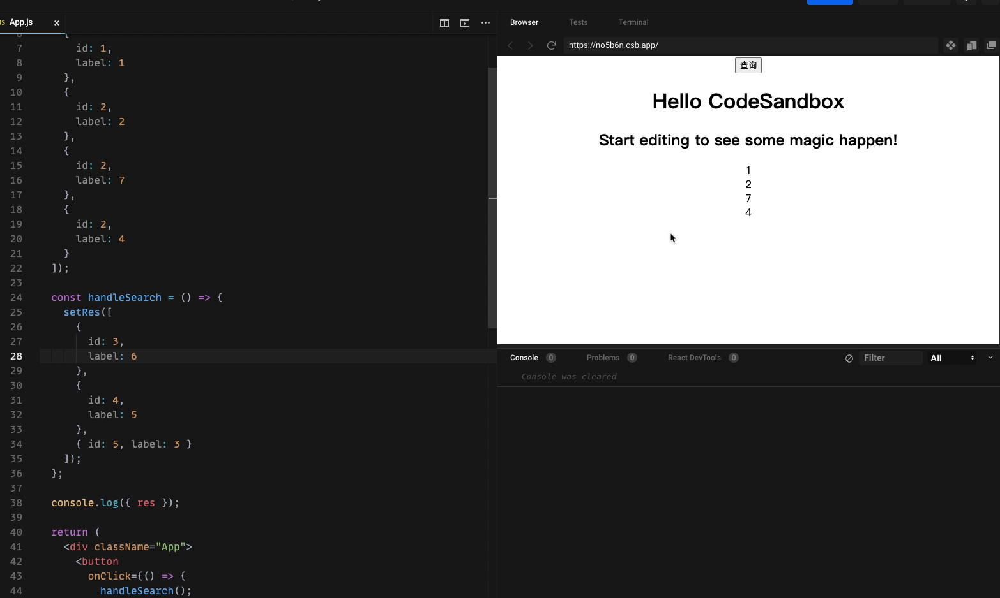

# 记录一次线上问题，详解 React Diff

最近收到产品反馈，在使用分页切换数据会发现保留上一页的**部分**数据，这个比较奇怪，于是我翻了翻代码。代码如下

```ts
const [list, setList] = useState([])

useEffect(() => {
  batchQueryGoodsDetail({ page }).then(res => {
    setList(res.list || [])
    setTotal(res.total || 0)
  })
}, [page])

return (
  <div>
    {list.map(k => (
      <ListItem key={k.id} />
    ))}
  </div>
)
```

在点击分页的时候会修改分页参数，从而触发接口的重新请求，正常来说只要返回的数据是正确的，那么渲染必然是正确的。然而事实是相反的，接口请求的数据是对的，但是页面渲染出来的数据是错误的，有的时候会携带上一页部分数据，有时候并不会。因为是不稳定复现，因此也就没有过于关注。

过了一段时间后，产品再次找过来说又出现了相同的问题，因为此时我也在忙紧急的需求，没有时间去看，就麻烦组长帮忙看下，最终找到了一个规律是如果后端返回的数据中有重复的数据(后端实际上不应该在一页中返回重复的数据)，切换分页就会把重复的部分数据携带到下一页中。来来回回从而就导致了存在很多重复的数据。

既然找到了问题，那就需要解决问题。我们尝试写一个 demo 来复现这个问题。代码如下

```tsx
import './styles.css'
import { useState } from 'react'

export default function App() {
  const [res, setRes] = useState([
    {
      id: 1,
      label: 1
    },
    {
      id: 2,
      label: 2
    },
    {
      id: 2,
      label: 7
    },
    {
      id: 2,
      label: 4
    }
  ])

  const handleSearch = () => {
    setRes([
      {
        id: 3,
        label: 6
      },
      {
        id: 4,
        label: 5
      },
      { id: 5, label: 3 }
    ])
  }

  console.log({ res })

  return (
    <div className="App">
      <button
        onClick={() => {
          handleSearch()
        }}
      >
        查询
      </button>
      <h1>Hello CodeSandbox</h1>
      <h2>Start editing to see some magic happen!</h2>
      {res.map((l, index) => {
        return <Item item={l} key={`${l.id}`} />
      })}
    </div>
  )
}

function Item({ item }) {
  return <div>{item.label}</div>
}
```

使用 `id` 作为 key，初始化的时候使用了三个重复的 id，当点击按钮的时候使用新的数据，新的数据中并不存在重复的 id。结果如下



从结果中可以看出设置的 `list` 仍然是正确的，但是页面渲染出来的结果确实错误的，保留了 `2` 和 `7`。代码中重复的 key 有三个分别是 `2`，`7`，`4` 那么为什么 `4` 被删除了但是 `2` 和 `7` 却保留了呢？

写过 React 的基本都知道，React 对数组的遍历要求必须要传 key，这本身是为了性能考虑。不传 key 会有什么影响吗？如果不传 key，对于 React 来说每次都要去销毁节点，再重新生成节点。大量且多次的销毁以及重建会影响到 React 渲染的性能，且每次销毁重建都会导致组件内部的状态丢失。因此传 key 给 React，相当于告诉 React，这个节点是否需要删除、新增或者是移动。更加清晰的解释可以看 [why react need keys](https://twitter.com/dan_abramov/status/1415279090446204929)。

既然知道是重复的 key 导致的，最简单的方法就是给之前的 key 上加一个 index。问题解决了，我们继续探索为什么 key 重复会导致节点保留。这就要涉及到 React 的 Diff 算法了，这里我们只看数组部分。具体参考卡颂的 [React 源码揭秘 3 Diff 算法详解](https://juejin.cn/post/6844904167472005134)，里面的代码和最新的 [React diff 源码](https://github.com/facebook/react/blob/main/packages/react-reconciler/src/ReactChildFiber.js#L744)的代码基本保持一致。我们就以卡颂的[简化版的代码](https://github.com/BetaSu/big-react/blob/8e6630eed13aa691a607330bfd8aa1196eca4297/packages/react-reconciler/src/childFiber.ts#L224)进行分析，代码如下，其实直接看卡颂的注释就明白了，重要的部分已经标记。

```ts{17-23,79-81}
function reconcileChildrenArray(
  returnFiber: FiberNode,
  currentFirstChild: FiberNode | null,
  newChild: any[],
  lanes: Lanes
) {
  // 遍历到的最后一个可复用fiber在before中的index
  let lastPlacedIndex = 0
  // 创建的最后一个fiber
  let lastNewFiber: FiberNode | null = null
  // 创建的第一个fiber
  let firstNewFiber: FiberNode | null = null

  // 遍历前的准备工作，将current保存在map中
  const existingChildren: ExistingChildren = new Map()
  let current = currentFirstChild
  while (current !== null) {
    const keyToUse = current.key !== null ? current.key : current.index
    // 注意这里存储的是一个 Map，Map 如果存在相同的 key 则会覆盖掉，根据上面的例子知道
    // 初始化的 key 为 1 2 2 2，经过 map 处理，只保留了最后一个 key 为 2 的节点信息
    existingChildren.set(keyToUse, current)
    current = current.sibling
  }

  // 遍历流程
  for (let i = 0; i < newChild.length; i++) {
    const after = newChild[i]

    // after对应的fiber，可能来自于复用，也可能是新建
    // 这里其实很简单，如果有可复用的就复用，没有会根据类型来判断是否需要创建
    const newFiber = updateFromMap(
      returnFiber,
      existingChildren,
      i,
      after,
      lanes
    ) as FiberNode

    /**
     * 考虑如下情况：
     * 更新前：你好{123}
     * 更新后：你好{null}
     *   或者：你好{false}
     *   或者：你好{undefined}
     */
    if (newFiber === null) {
      continue
    }

    newFiber.index = i
    newFiber.return = returnFiber

    if (lastNewFiber === null) {
      lastNewFiber = firstNewFiber = newFiber
    } else {
      lastNewFiber = (lastNewFiber.sibling as FiberNode) = newFiber
    }

    if (!shouldTrackEffects) {
      continue
    }
    const current = newFiber.alternate
    if (current !== null) {
      const oldIndex = current.index
      if (oldIndex < lastPlacedIndex) {
        // 移动
        newFiber.flags |= Placement
        continue
      } else {
        // 不移动
        lastPlacedIndex = oldIndex
      }
    } else {
      // fiber不能复用，插入新节点
      newFiber.flags |= Placement
    }
  }

  // 遍历后的收尾工作，标记existingChildren中剩余的删除
  existingChildren.forEach(fiber => {
    deleteChild(returnFiber, fiber)
  })
  return firstNewFiber
}
```
