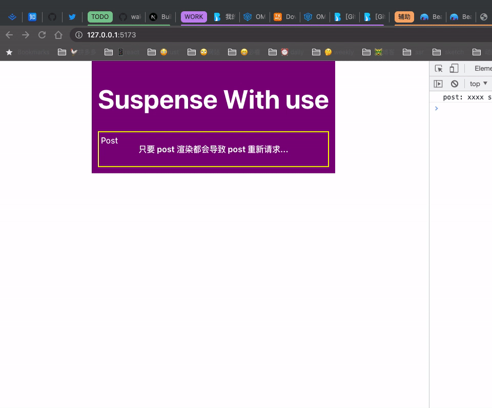
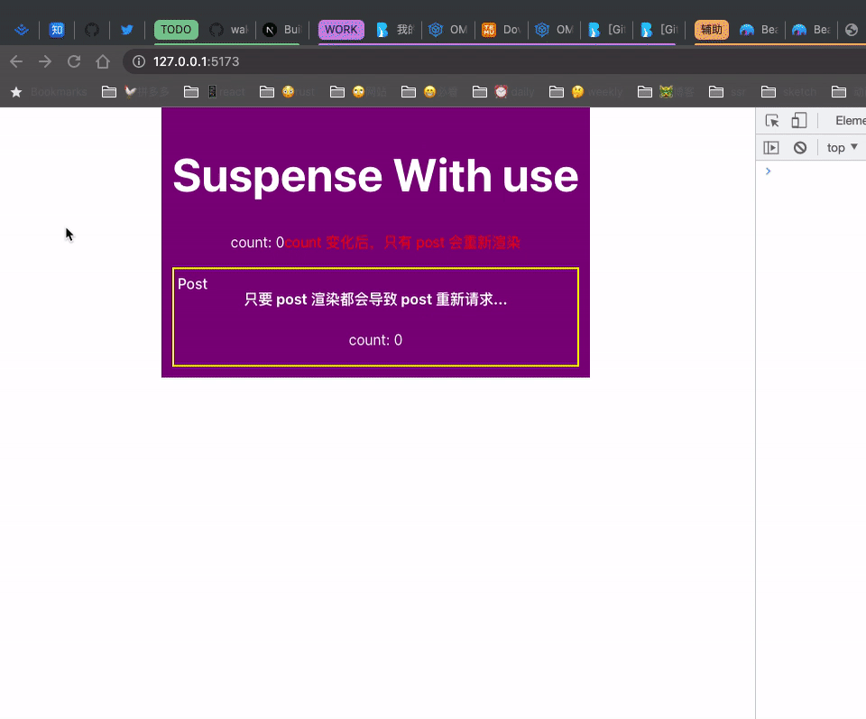

# experimental_use

[experimental_use](https://github.com/facebook/react/pulls?q=experimental_use) 是 React 体验版本的一个功能，可以用于解析 promise，通常配合 Suspense 一起使用。

## 如何使用？

[experimental_use](https://github.com/facebook/react/pulls?q=experimental_use) 可以用于解析 promise，在组件 render 的期间等待 promise 完成。先看看以前是如何在 React 组件中进行请求的。

```tsx
import { useState, useEffect } from 'react'

function App() {
  const [list, setList] = useState([])

  useEffect(() => {
    fetch('/a/b').then(res => {
      const nextV = res.json()
      setList(nextV)
    })
  }, [])

  return (
    <div>
      {list.map(l => (
        <div>{l}</div>
      ))}
    </div>
  )
}
```

通过 `useState` 和 `useEffect` 配合使用，获取到数据后放在 state 里，可能有的人会说这样每次都要写这么多胶水代码，没啥意义，确实如此。

目前已经有很多库对请求这块进行了封装，比如 [useSwr](https://swr.vercel.app/) 和 [React query](https://tanstack.com/query/v3/)。这些库都很好的处理了请求的状态，比如错误信息、loading 等的封装，并且在内部也解决了竞态问题。

早在 React17 的时候已经引入了 [Suspense](https://react.dev/reference/react/Suspense) 的概念，但是很少使用，基本上使用都是配合 [lazy-load](https://react.dev/reference/react/lazy#lazy)。而自从 [React 18 New Suspense SSR](https://github.com/reactwg/react-18/discussions/37) 发布后，Suspense 的使用再次回到了大众的视野，大家都在考虑如何集成，但是其中一个比较大的问题就是数据请求。虽然 Suspense 内部已经解决了竞态这些问题，但是如何配合数据请求是一个比较大的问题。

目前大多数的做法都是抛出一个 promise 让 Suspense 来捕获，包括我自己写的 [use-suspense-fetch](https://github.com/snakeUni/use-suspense-fetch)，React 团队自己不建议这么做，这属于一种比较 hack 的做法吧。比较期待 React 团队关于数据请求这块的官方作品。

回到 `experimental_use`，这是 React 团队出的一个 Hook，正如上面所说用于解析 promise,但是注意这里并没有缓存的作用。现在我们就来尝试使用下，并且探讨下如何实现一个简单的 `useSuspense` hook。如果你对 suspense 的请求感兴趣，也可以看 React devtool 工具的作者写的 [suspense](https://github.com/bvaughn/suspense)。

### 安装 canary 版本

最新的 React blog [react-canaries](https://react.dev/blog/2023/05/03/react-canaries) 已经说明后续 React 的新功能并且最终会稳定发布的都会在 canary 的版本中体现，canary 版本出现的问题，他们也会当做正式版本一样来修复。

```shell
yarn add react@18.3.0-canary-aef7ce554-20230503
yarn add react-dom@18.3.0-canary-aef7ce554-20230503
```

### 使用 use

下面将会一步一步详细的丰富 use 的使用方式，以及各个方式的优缺点。先实现一个简单的 promise 用于后续 use 使用。后续的代码将省去 sleep 的代码，直接使用。

```tsx
const sleep = (time = 1000) => {
  return new Promise(resolve => {
    setTimeout(() => {
      resolve('xxxx')
    }, time)
  })
}
```

实现了 sleep 后，我们将使用 use 来解析 sleep 的数据。

```tsx
import { use } from 'react'

function App() {
  return (
    <div style={{ background: 'purple', padding: 12, color: '#fff' }}>
      <h1>Suspense With use </h1>
      <Suspense fallback={<div>loading post...</div>}>
        <Post />
      </Suspense>
    </div>
  )
}

function Post({ status }) {
  const v = use(sleep())
  return (
    <div
      style={{ border: '2px solid yellow', marginTop: 12 }}
      className="wrapper"
    >
      <div className="title">Post</div>
      <h4>只要 post 渲染都会导致 post 重新请求...</h4>
    </div>
  )
}
```



可以看出每次刷新都会触发 suspense 的 fallback，当 post 内部的 sleep() resolved 后就会渲染 post 组件。那代表是否这样就可以了呢？心细的同学应该看出了问题，Post 组件内部调用 `use(sleep())` 那么是否代表只要 Post 组件重新渲染就会导致触发 suspense 的 fallback 呢？

我们不妨来试验下，先修改一个代码，我们给 App 组件以及 Post 组件内部都加上状态

先增加一个 `useCount` hook，后续涉及到相关 hook 将不在列出代码

```tsx
import { useState } from 'react'

export function useCount() {
  const [count, setCount] = useState(0)

  return <span onClick={() => setCount(count + 1)}>count: {count}</span>
}
```

App 组件和 Post 组件内部都增加状态

```tsx
import { use } from 'react'

function App() {
  const [count, setCount] = useState(0)

  return (
    <div style={{ background: 'purple', padding: 12, color: '#fff' }}>
      <h1>Suspense With use </h1>
      <p>
        <span onClick={() => setCount(count + 1)}>
          count: {count}
          <span style={{ color: 'red' }}>
            count 变化后，只有 post 会重新渲染
          </span>
        </span>
      </p>
      <Suspense fallback={<div>loading post...</div>}>
        <Post />
      </Suspense>
    </div>
  )
}

function Post({ status }) {
  const v = use(sleep())
  const countNode = useCount()
  return (
    <div
      style={{ border: '2px solid yellow', marginTop: 12 }}
      className="wrapper"
    >
      <div className="title">Post</div>
      <h4>只要 post 渲染都会导致 post 重新请求...</h4>
      <p>{countNode}</p>
    </div>
  )
}
```

目前我们在 App 和 Post 组件中都增加了状态，现在来验证下是否只要 Post 重新渲染，都会触发 Suspense 的 fallback 呢？



可以看出只要触发 Post 重新渲染就会触发到 Suspense 的 fallback，这明显是不合理的。我们是否有其他的办法解决呢？

答案是有的，就当前问题来说有多种解决办法，我们只介绍下面的 3 种

- 使用外部缓存：比如使用一个 Map 对 use 的方法进行缓存
- 将请求函数放在外部
- 使用内部缓存

#### 使用外部缓存

对于使用外部缓存的，其实很简单，我们用一个 key 来记录当前的 promise 即可，这种做法是已有的 suspense fetch 的库的通用做法，可以参考 [use-suspense-fetch](https://github.com/snakeUni/use-suspense-fetch)

#### 请求函数在外部

将请求函数放在外部，实际上就可以保证这个 promise 完成中，即使组件重新渲染也不会导致重新请求。使用 Post2 组件来实现这个

```tsx
const catchReject = sleep()

function Post2({ status }) {
  const v = use(catchReject)
  console.log('post2:', v, 'status:', status)
  const countNode = useCount()
  return (
    <div
      style={{ border: '2px solid green', marginTop: 12 }}
      className="wrapper"
    >
      <div className="title">Post2</div>
      <h4>任何变化都不会导致 post2 重新请求...</h4>
      <p>{countNode}</p>
    </div>
  )
}

// 将 Post2 组件放在 App 中

function App() {
  const [count, setCount] = useState(0)

  return (
    <div style={{ background: 'purple', padding: 12, color: '#fff' }}>
      <h1>Suspense With use </h1>
      <p>
        <span onClick={() => setCount(count + 1)}>
          count: {count}
          <span style={{ color: 'red' }}>
            count 变化后，只有 post 会重新渲染
          </span>
        </span>
      </p>
      <Suspense fallback={<div>loading post...</div>}>
        <Post />
      </Suspense>
      <Suspense fallback={<div>loading post2...</div>}>
        <Post2 />
      </Suspense>
    </div>
  )
}
```

此时点击 count 看下 Post2 是否会重新渲染。


可以看出 Post2 在 count 发生变化后并不会重新渲染，并且 Post2 展示的也比 Post 的要早。这个很容易理解，以为 Post2 use 里的 promise 在当前 js 加载好就开始运行了，而 Post 中是组件渲染的时候才运行，所以 Post2 展示的要比 Post 要早。并且因为 Post2 中使用的 promise 后续组件无论如何重新渲染，都不会改变 promise 的状态。这也就是为啥父组件 count 变化，Post2 始终不会触发 fallback 的原因。

那是否只要请求放在外部就万事大吉了呢？当然不是，因此请求通常会携带参数的，当参数变化的时候需要重新触发请求。或者 Post2 组件被卸载后再重新 mount 也应该重新触发请求获取最新数据，显示当前的形式是满足不了的。那是否没有办法了呢？往下看第三种方法。

#### 使用内部缓存

说到内部缓存，大家都会想到三个 hook `useMemo`，`useCallback` 和 `useRef`。这三个 hook 在一定程度上都能实现缓存，本次我们主要使用 useMemo 来对 promise 最终的值进行缓存。我们新增 Post1 组件

```tsx
function Post1() {
  // 缓存了状态
  const memoReject = useMemo(sleep()), [])
  const v = use(memoReject)
  const countNode = useCount()
  return (
    <div style={{ border: '2px solid red', marginTop: 12 }} className="wrapper">
      <div className="title">Post1</div>
      <h4>只有 status 变化才会导致 post1 重新请求...</h4>
      <p>{countNode}</p>
    </div>
  )
}

function App() {
  const [count, setCount] = useState(0)

  return (
    <div style={{ background: 'purple', padding: 12, color: '#fff' }}>
      <h1>Suspense With use </h1>
      <p>
        <span onClick={() => setCount(count + 1)}>
          count: {count}
          <span style={{ color: 'red' }}>
            count 变化后，只有 post 会重新渲染
          </span>
        </span>
      </p>
      <Suspense fallback={<div>loading post...</div>}>
        <Post />
      </Suspense>
      <Suspense fallback={<div>loading post2...</div>}>
        <Post2 />
      </Suspense>
      <Suspense fallback={<div>loading post1...</div>}>
        <Post1 />
      </Suspense>
    </div>
  )
}
```

从理论上来说目前 Post2 和 Post1 都实现了无论外部状态还是内部状态变化都不会触发 suspense 的 fallback。


可以看出无论是父组件的 count 变化，还是 Post1 内部的 count 变化都不会触发 Post1 重新渲染。但是我们之前讲过有的时候需要触发重新请求，比如请求存在参数，当参数变化的时候需要重新触发请求，在第二个方法中不好实现，在第三种方法中很好实现。我们继续改下代码，增加一个 status 参数，当 status 参数变化的时候，需要重新触发 Post1 内部的重新请求，对代码进行如下修改：

```tsx
function Post1({ status }) {
  // post1 这里增加了 status 作为 useMemo 的依赖
  const memoReject = useMemo(() => sleep(), [status])
  const v = use(memoReject)
  const countNode = useCount()
  return (
    <div style={{ border: '2px solid red', marginTop: 12 }} className="wrapper">
      <div className="title">Post1</div>
      <h4>只有 status 变化才会导致 post1 重新请求...</h4>
      <p>{countNode}</p>
    </div>
  )
}

function App() {
  const [count, setCount] = useState(0)
  const [status, setStatus] = useState(0)

  return (
    <div style={{ background: 'purple', padding: 12, color: '#fff' }}>
      <h1>Suspense With use </h1>
      <p>
        <span onClick={() => setCount(count + 1)}>
          count: {count}
          <span style={{ color: 'red' }}>
            count 变化后，只有 post 会重新渲染
          </span>
        </span>
      </p>
      <p>
        <span onClick={() => setStatus(status + 1)}>
          post 依赖的状态: {status}{' '}
          <span style={{ color: 'red' }}>
            status 变化后，post 和 post1 会重新渲染
          </span>
        </span>
      </p>
      <Suspense fallback={<div>loading post...</div>}>
        <Post status={status} />
      </Suspense>
      <Suspense fallback={<div>loading post2...</div>}>
        <Post2 status={status} />
      </Suspense>
      <Suspense fallback={<div>loading post1...</div>}>
        <Post1 status={status} />
      </Suspense>
    </div>
  )
}
```

分别点击 count 和 status 观察下 Post1 是否会重新触发 suspense


可以看出 status 变化会触发 Post1 的重新请求。解决了方法 2 中提出的无法根据参数变化重新请求的问题。根据上面的代码我们可以很容易的提出一个公共的 hook 来实现 suspense fetch

```tsx
export function useSuspense(callback, parmas) {
  const memoValue = useMemo(() => callback(), [JSON.stringify(parmas)])
  return use(memoValue)
}
```

## 结论

use 函数用于解析 promise 的状态从而获取到对应的值，需要配合 suspense 一起使用。如果要达到 suspense fetch 的效果还需要配合缓存来实现。再贴一遍 `useSuspense` 的 hook，实际上要想真正达到 suspense 的效果还差一点，React 之前的 suspense 例子中只有第一次请求会触发 fallback，后续再触发请求之前的数据也会被保存，新的数据到达后展示新的数据。这个后续再继续探索了。

```tsx
export function useSuspense(callback, parmas) {
  const memoValue = useMemo(() => callback(), [JSON.stringify(parmas)])
  return use(memoValue)
}
```
