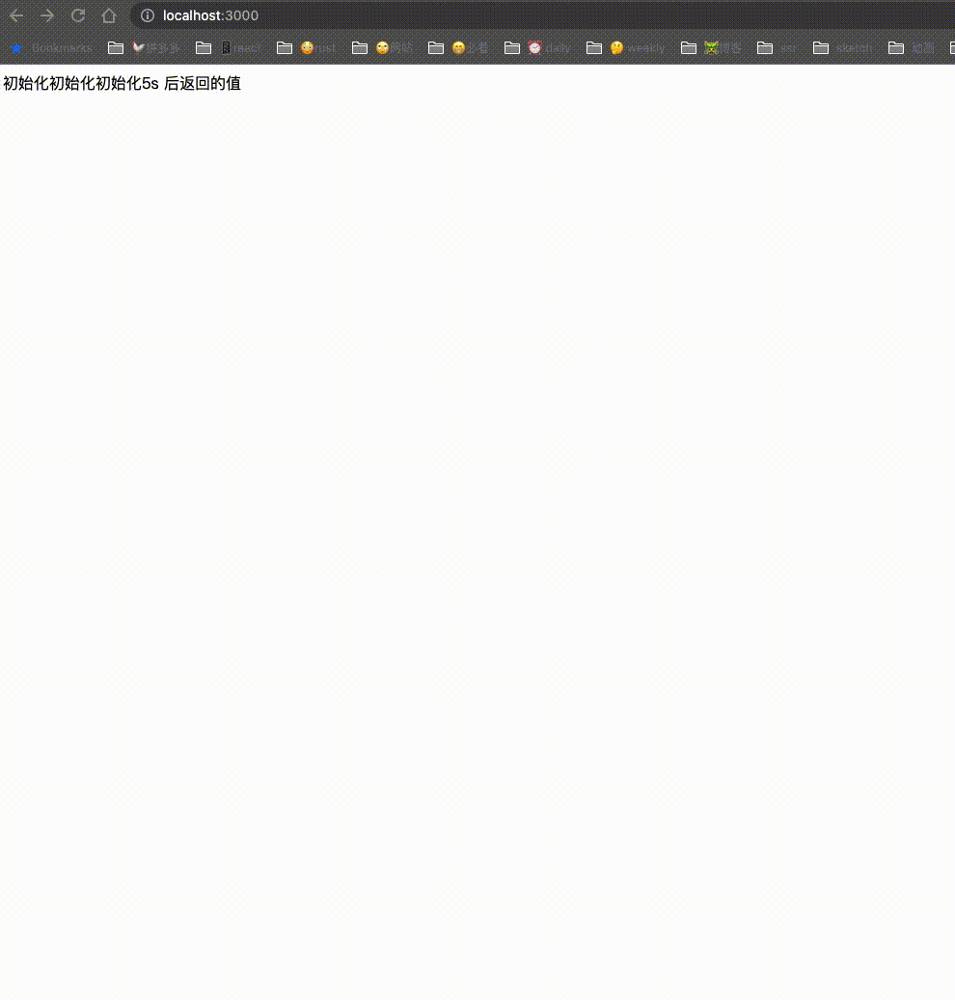
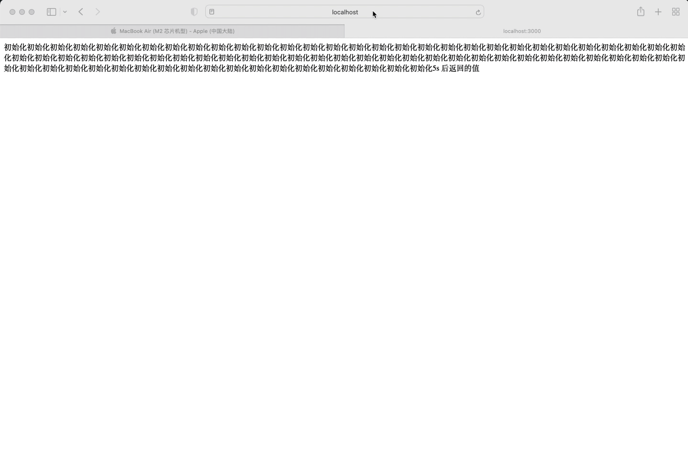

# SSR Safari

最近在做 React SSR 相关的改造，但是有部分业务即使上了 SSR，页面打开后仍然有白屏。后来组内的同事研究了下发现 ios 的 webview 并不支持 stream 的形式。这是我们得出的初步结论，也是为什么我们业务上了 SSR 后，ios 效果不好的原因。

现在用一份简单的代码来试试效果。使用 `koa` 初始化一个最简单的项目。加上如下代码

```ts
const Koa = require('koa')
const app = new Koa()
const { Readable } = require('stream')

const sleep = delay => {
  return new Promise(resolve => {
    setTimeout(resolve, delay)
  })
}

app.use(async ctx => {
  const res = Readable.from([
    '初始化初始化初始化',
    sleep(5000).then(() => {
      return '5s 后返回的值'
    })
  ])

  ctx.type = 'text/html'
  ctx.status = 200

  ctx.body = res
})

app.listen(3000)
```

在 chrome 上的效果如下所示：



可以看出 chrome 是先返回部分内容，5s 后返回对应的内容。

再看看 safari 上的效果


可以看出 safari 会一直等内容全部返回后，然后一次性返回到客户端。

那么真的是这样吗？一开始同事得出的结论是这样的，我们实现了下也是这样的，我们就评估 ios 上的确不好做 SSR，但是其他同事发了另外一篇文章[iOS 之深入解析 WKWebView 加载的生命周期与代理方法](https://bbs.huaweicloud.com/blogs/331397)。

划重点

> 如果返回的 data 是普通文本文字，或返回的数据中包含普通文本文字，那只需要达到非空 200 字节即可以触发上屏渲染；  
> 如果返回的 data 是图片资源类，则判断像素大小 > 32\*32，即可触发上屏渲染；  
> 如果不满足以上条件，对于主文档，判断后面是否继续接收数据，如果不继续，则触发上屏渲染；如后续还有数据，则循环上述流程直至触发上屏。渲染完成，整个加载过程结束。

如果触发上屏渲染，必须满足以上条件才可以。同时这篇文章[脚本下载会阻塞 Mobile Safari 首屏渲染](https://zhuanlan.zhihu.com/p/68290048)中也提到了相关问题。

我们不妨将之前的代码修改下，对于返回的第一部分，使其大小超过 200 字节。

```ts
app.use(async ctx => {
  const res = Readable.from([
    '初始化初始化初始化初始化初始化初始化初始化初始化初始化初始化初始化初始化初始化初始化初始化初始化初始化初始化初始化初始化初始化初始化初始化初始化初始化初始化初始化初始化初始化初始化初始化初始化初始化初始化初始化初始化初始化初始化初始化初始化初始化初始化初始化初始化初始化初始化初始化初始化初始化初始化初始化初始化初始化初始化初始化初始化初始化初始化初始化初始化初始化初始化初始化初始化初始化初始化初始化初始化初始化初始化初始化初始化初始化初始化初始化初始化初始化初始化',
    sleep(5000).then(() => {
      return '5s 后返回的值'
    })
  ])

  ctx.type = 'text/html'
  ctx.status = 200

  ctx.body = res
})
```

chrome 的效果和之前是一致的，因此这里不作具体展示，看看 safari 的效果。



可以看出 safari 也支持流式传输了。
